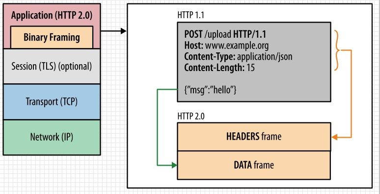
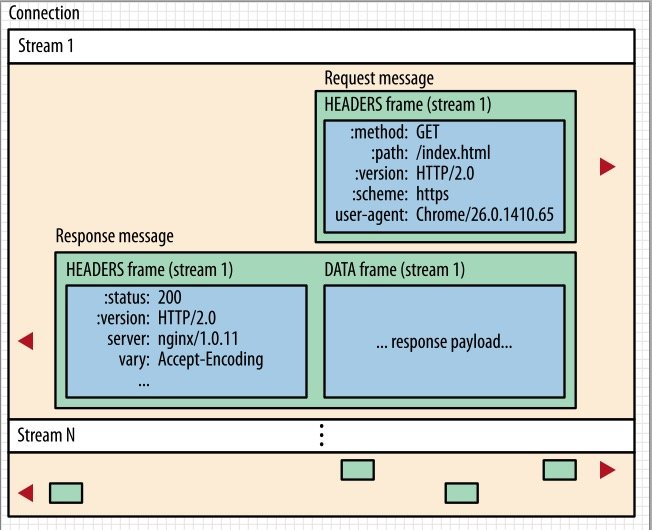
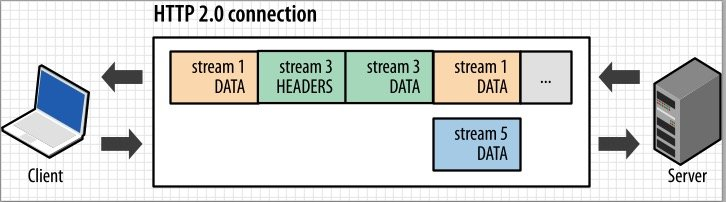
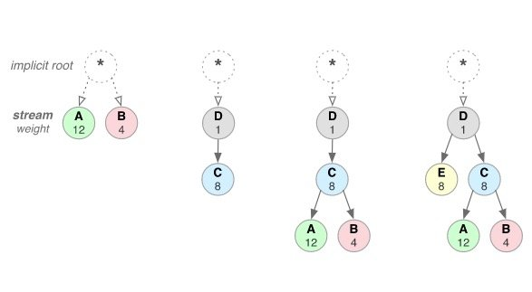

# HTTP协议发展历程

HTTP 最早诞生的版本是 0.9，于1991年提出。最早的需求很简单主要是在两个网络之间传输 HTML 内容，所以被称为超文本传输协议。

早期的互联网也非常的简单，常见的都是静态页面。所以刷互联网基本都是一些 BBS 帖子之类的。HTTP/0.9 的实现有 3 个特点：

请求只有请求行，没有请求头和请求体。静态页面不需要这些。
服务器有不需要返回头信息，只需要返回请求数据即可。
返回文件的内容是 ASCII 字节码来传输的，因为都是 HTML 文件，用 ASCII 字节码来传输也比较合适。
## HTTP/1.0 – 构建可扩展性
到了 1994 年之后，网络发展的速度超出大家的预估，简单的 HTML 不再能满足日益增长的互联网用户需求，动态交互的需求使得新的交互协议出现进而促进了浏览器领域的变革，图片，音频，文件传输，动态渲染等等我们今天看起来很平常的功能在当时是非常炫酷的东西。那么之前的 0.9 版本协议必然不能满足当前需求，所以新的版本最核心的需求就是支持多协议，多编码。

HTTP/1.0 的特性如下：

HTTP/1.0 版本是一种无状态、无连接的应用层协议。
浏览器与服务器每次请求都要建立连接，服务器处理完毕立刻断开连接。即浏览器与服务器之间只保持很短的连接时间。
队头阻塞。HTTP/1.0规定下一个请求必须在前一个请求响应到达之后才能发送。即如果前一个请求响应一直不达到那么下一个请求也不会发送，后面的一直被阻塞。
## HTTP/1.1 – 标准化的协议
基于上面 1.0 的缺点，亟待解决的问题有：

是否可以不用每次都重新建立连接；
请求是否可以并行化，不用被阻塞。
所以在 1.1 版本做了如下优化：

首先是长连接。HTTP/1.1增加了一个 Connection 字段，通过设置 Keep-Alive 可以保持 HTTP 连接不断开，避免了每次客户端与服务器请求都要重复建立释放建立TCP连接，提高了网络的利用率。如果客户端想关闭 HTTP 连接，可以在请求头中携带 Connection: false来告知服务器关闭请求。
其次是 HTTP/1.1支持请求管道化（pipelining）。基于 HTTP/1.1 的长连接，使得请求管线化成为可能。管线化使得请求能够“并行”传输。举个例子来说，假如响应的主体是一个 html 页面，页面中包含了很多 img，这个时候 keep-alive 就起了很大的作用，能够进行“并行”发送多个请求。
在HTTP/1.1 中增加 Host 请求头字段。我们可以在一台 WEB 服务器上可以在同一个IP地址和端口号上使用不同的主机名来创建多个虚拟 WEB 站点。
HTTP/1.1 还提供了与身份认证、状态管理和 Cache 缓存等机制相关的请求头和响应头。
HTTP/1.1 支持断点续传。
这里要说的是，HTTP/1.1 管道化所谓的并行传输其实并未做到真正的并行。服务器必须按照客户端请求的先后顺序依次回送相应的结果，以保证客户端能够区分出每次请求的响应内容。即管道化做的事情是把先进先出的队列从客户端迁移到了服务器，由服务器来维护这个状态。

但是在服务器的响应是有先后顺序的。比如：

客户端同时发送两个请求：

请求获取 html 资源；
请求获取 css 资源；
这时候在服务器是 css 资源先准备好，但是服务器还是会等 html 资源准备好先发送 html 资源，等响应完毕再发送css资源。可见所谓的管道化技术还是无法解决 “阻塞” 的问题。同时，因为管道化技术存在各种各种的问题，浏览器厂商要么直接关闭该功能，要么就直接不支持，所以实际上该功能并没有被用到。

目前浏览器厂商采用的做法是针对同一个域名，最多允许同时发起6个请求，所以通过这种方式真正的做到了并行。

## HTTP/2
HTTP 协议的早期版本是专门为简化实现而设计的：

HTTP / 0.9 是用于引导万维网的单行协议；

HTTP / 1.0 在信息标准中记录了对 HTTP / 0.9 的流行扩展；

HTTP / 1.1 引入了正式的 IETF 标准。

不幸的是，HTTP / 1.x 实现简单性也以牺牲应用程序性能为代价：

客户端需要使用多个连接来实现并发和减少延迟；

不会压缩请求和响应头，从而导致不必要的网络流量；

不允许有效的资源优先级划分，从而导致底层 TCP 连接的使用不充分。

这些限制并不是致命的，但是随着 Web 应用程序的范围，复杂性和在日常生活中的重要性不断增长，它们给 Web 开发人员和用户带来了越来越大的负担，这正是 HTTP / 2旨在解决：

HTTP / 2 对 HTTP / 1.1 的主要更改集中在提高性能上：诸如多路复用，标头压缩，优先级划分和协议协商之类的一些关键功能。

二进制框架

HTTP / 2 所有性能增强的核心是新的二进制框架层，该层指示如何在客户端和服务器之间封装和传输HTTP消息。

  

新的二进制框架旨在对请求体内容做进一步编码以使得传输更为高效，HTTP语义（请求头，请求行）不受影响，但是它们的方式在运输过程中的编码是不同的。与换行符分隔的纯文本HTTP / 1.x协议不同，所有HTTP / 2通信都分为较小的消息和帧，每个消息和帧均以二进制格式编码。主要有以下概念：

流，消息和帧

新的二进制框架机制的引入改变了客户端和服务器之间数据交换的方式。为了描述这个过程，让我们熟悉一下HTTP / 2术语：

流：已建立的连接内的双向字节流，可以携带一个或多个消息。
消息：映射到逻辑请求或响应消息的帧的完整序列。
帧：HTTP / 2中的最小通信单元，每个通信单元都包含一个帧头，该头至少标识了帧所属的流。
这些术语的关系可以概括如下：

所有通信都是通过单个 TCP 连接执行的，该TCP连接可以承载任意数量的双向流。
每个流都有一个唯一的标识符和可选的优先级信息，用于承载双向消息。
每个消息都是逻辑 HTTP 消息，例如请求或响应，由一个或多个帧组成。
帧是承载特定类型的数据（例如 HTTP 标头，消息有效负载等）的最小通信单元。来自不同流的帧可以被交织，然后通过每个帧头中的嵌入式流标识符重新组合。

  

简而言之，HTTP / 2 将 HTTP 协议通信分解为交换二进制编码的帧，然后将其映射到属于特定流的消息，所有这些消息都在单个 TCP 连接中进行多路复用。这是启用 HTTP / 2 协议提供的所有其他功能和性能优化的基础。

请求和响应多路复用

使用 HTTP / 1.x，如果客户端希望发出多个并行请求以提高性能，则必须使用多个 TCP 连接。此行为是HTTP / 1.x 传递模型的直接结果，该模型确保每个连接一次只能传递一个响应（响应队列）。更糟糕的是这还会导致行头阻塞和底层 TCP 连接的低效使用。

HTTP / 2中新的二进制框架层消除了这些限制，并通过允许客户端和服务器将 HTTP 消息分解为独立的帧，进行交织，然后在另一端重新组装，从而实现了完整的请求和响应多路复用。  

  

快照捕获同一连接中正在运行的多个流。客户端正在DATA向服务器传输帧（流5），而服务器正在向客户端传输流 1 和 3 的帧的交错序列。结果，正在运行三个并行流。

将 HTTP 消息分解为独立的帧，进行交织，然后在另一端重新组装的能力，是HTTP / 2 的最重要的增强。实际上，它在所有 Web 技术的整个堆栈中引入了许多性能优势的连锁反应，使我们能够：

并行交错多个请求，而不会阻塞任何一个。
并行交错多个响应，而不会阻塞任何一个。
使用单个连接并行传递多个请求和响应。
删除不必要的HTTP / 1.x解决方法（请参阅 优化HTTP / 1.x，例如级联文件，图像精灵和域分片）。
通过消除不必要的延迟并提高可用网络容量的利用率，缩短页面加载时间。
HTTP / 2 中新的二进制框架层解决了 HTTP / 1.x 中出现的行头阻塞问题，并且消除了对多个连接的需要，以实现请求和响应的并行处理以及传递。  

流优先级

一旦 HTTP 消息可以分为多个单独的帧，并且我们允许将来自多个流的帧进行多路复用，则客户端和服务器对帧进行交错和传递的顺序就成为了关键的性能考量。为方便起见，HTTP / 2 标准允许每个流具有关联的权重和依赖性：

可以为每个流分配 1 到 256 之间的整数权重。
每个流可以被赋予对另一个流的显式依赖。
流依赖性和权重的组合使客户端可以构建和传达“优先级树”，该树表示希望接收响应的方式。反过来，服务器可以使用此信息通过控制 CPU，内存和其他资源的分配来优先处理流，并且一旦响应数据可用，就可以分配带宽以确保将高优先级响应最佳地交付给客户端。  

  

https://www.cnblogs.com/rickiyang/p/13138574.html  

