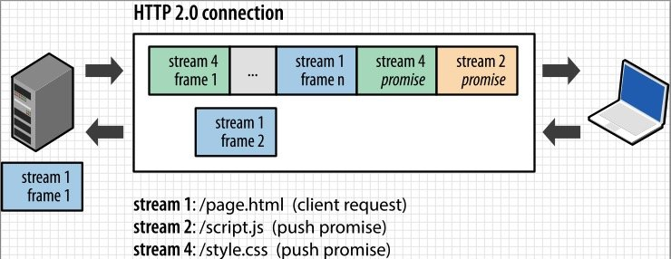

# HTTP协议发展历程

HTTP 最早诞生的版本是 0.9，于1991年提出。最早的需求很简单主要是在两个网络之间传输 HTML 内容，所以被称为超文本传输协议。

早期的互联网也非常的简单，常见的都是静态页面。所以刷互联网基本都是一些 BBS 帖子之类的。HTTP/0.9 的实现有 3 个特点：

请求只有请求行，没有请求头和请求体。静态页面不需要这些。
服务器有不需要返回头信息，只需要返回请求数据即可。
返回文件的内容是 ASCII 字节码来传输的，因为都是 HTML 文件，用 ASCII 字节码来传输也比较合适。
## HTTP/1.0 – 构建可扩展性
到了 1994 年之后，网络发展的速度超出大家的预估，简单的 HTML 不再能满足日益增长的互联网用户需求，动态交互的需求使得新的交互协议出现进而促进了浏览器领域的变革，图片，音频，文件传输，动态渲染等等我们今天看起来很平常的功能在当时是非常炫酷的东西。那么之前的 0.9 版本协议必然不能满足当前需求，所以新的版本最核心的需求就是支持多协议，多编码。

HTTP/1.0 的特性如下：

HTTP/1.0 版本是一种无状态、无连接的应用层协议。
浏览器与服务器每次请求都要建立连接，服务器处理完毕立刻断开连接。即浏览器与服务器之间只保持很短的连接时间。
队头阻塞。HTTP/1.0规定下一个请求必须在前一个请求响应到达之后才能发送。即如果前一个请求响应一直不达到那么下一个请求也不会发送，后面的一直被阻塞。
## HTTP/1.1 – 标准化的协议
基于上面 1.0 的缺点，亟待解决的问题有：

1. 是否可以不用每次都重新建立连接；
2. 请求是否可以并行化，不用被阻塞。
所以在 1.1 版本做了如下优化：

1. 首先是长连接。HTTP/1.1增加了一个 Connection 字段，通过设置 Keep-Alive 可以保持 HTTP 连接不断开，避免了每次客户端与服务器请求都要重复建立释放建立TCP连接，提高了网络的利用率。如果客户端想关闭 HTTP 连接，可以在请求头中携带 Connection: false来告知服务器关闭请求。
2. 其次是 HTTP/1.1支持请求管道化（pipelining）。基于 HTTP/1.1 的长连接，使得请求管线化成为可能。管线化使得请求能够“并行”传输。举个例子来说，假如响应的主体是一个 html 页面，页面中包含了很多 img，这个时候 keep-alive 就起了很大的作用，能够进行“并行”发送多个请求。
3. 在HTTP/1.1 中增加 Host 请求头字段。我们可以在一台 WEB 服务器上可以在同一个IP地址和端口号上使用不同的主机名来创建多个虚拟 WEB 站点。
4. HTTP/1.1 还提供了与身份认证、状态管理和 Cache 缓存等机制相关的请求头和响应头。
5. HTTP/1.1 支持断点续传。
这里要说的是，HTTP/1.1 管道化所谓的并行传输其实并未做到真正的并行。服务器必须按照客户端请求的先后顺序依次回送相应的结果，以保证客户端能够区分出每次请求的响应内容。即管道化做的事情是把先进先出的队列从客户端迁移到了服务器，由服务器来维护这个状态。

但是在服务器的响应是有先后顺序的。比如：

客户端同时发送两个请求：

1. 请求获取 html 资源；
2. 请求获取 css 资源；
这时候在服务器是 css 资源先准备好，但是服务器还是会等 html 资源准备好先发送 html 资源，等响应完毕再发送css资源。可见所谓的管道化技术还是无法解决 “阻塞” 的问题。同时，因为管道化技术存在各种各种的问题，浏览器厂商要么直接关闭该功能，要么就直接不支持，所以实际上该功能并没有被用到。

目前浏览器厂商采用的做法是针对同一个域名，最多允许同时发起6个请求，所以通过这种方式真正的做到了并行。

## HTTP/2
HTTP 协议的早期版本是专门为简化实现而设计的：

HTTP / 0.9 是用于引导万维网的单行协议；

HTTP / 1.0 在信息标准中记录了对 HTTP / 0.9 的流行扩展；

HTTP / 1.1 引入了正式的 IETF 标准。

不幸的是，HTTP / 1.x 实现简单性也以牺牲应用程序性能为代价：

客户端需要使用多个连接来实现并发和减少延迟；

不会压缩请求和响应头，从而导致不必要的网络流量；

不允许有效的资源优先级划分，从而导致底层 TCP 连接的使用不充分。

这些限制并不是致命的，但是随着 Web 应用程序的范围，复杂性和在日常生活中的重要性不断增长，它们给 Web 开发人员和用户带来了越来越大的负担，这正是 HTTP / 2旨在解决：

HTTP / 2 对 HTTP / 1.1 的主要更改集中在提高性能上：诸如多路复用，标头压缩，优先级划分和协议协商之类的一些关键功能。

二进制框架

HTTP / 2 所有性能增强的核心是新的二进制框架层，该层指示如何在客户端和服务器之间封装和传输HTTP消息。

  

新的二进制框架旨在对请求体内容做进一步编码以使得传输更为高效，HTTP语义（请求头，请求行）不受影响，但是它们的方式在运输过程中的编码是不同的。与换行符分隔的纯文本HTTP / 1.x协议不同，所有HTTP / 2通信都分为较小的消息和帧，每个消息和帧均以二进制格式编码。主要有以下概念：

流，消息和帧

新的二进制框架机制的引入改变了客户端和服务器之间数据交换的方式。为了描述这个过程，让我们熟悉一下HTTP / 2术语：

+ 流：已建立的连接内的双向字节流，可以携带一个或多个消息。
+ 消息：映射到逻辑请求或响应消息的帧的完整序列。
+ 帧：HTTP / 2中的最小通信单元，每个通信单元都包含一个帧头，该头至少标识了帧所属的流。
这些术语的关系可以概括如下：

+ 所有通信都是通过单个 TCP 连接执行的，该TCP连接可以承载任意数量的双向流。
+ 每个流都有一个唯一的标识符和可选的优先级信息，用于承载双向消息。
+ 每个消息都是逻辑 HTTP 消息，例如请求或响应，由一个或多个帧组成。
+ 帧是承载特定类型的数据（例如 HTTP 标头，消息有效负载等）的最小通信单元。来自不同流的帧可以被交织，然后通过每个帧头中的嵌入式流标识符重新组合。

  

简而言之，HTTP / 2 将 HTTP 协议通信分解为交换二进制编码的帧，然后将其映射到属于特定流的消息，所有这些消息都在单个 TCP 连接中进行多路复用。这是启用 HTTP / 2 协议提供的所有其他功能和性能优化的基础。

## 请求和响应多路复用

使用 HTTP / 1.x，如果客户端希望发出多个并行请求以提高性能，则必须使用多个 TCP 连接。此行为是HTTP / 1.x 传递模型的直接结果，该模型确保每个连接一次只能传递一个响应（响应队列）。更糟糕的是这还会导致行头阻塞和底层 TCP 连接的低效使用。

HTTP / 2中新的二进制框架层消除了这些限制，并通过允许客户端和服务器将 HTTP 消息分解为独立的帧，进行交织，然后在另一端重新组装，从而实现了完整的请求和响应多路复用。  

  

快照捕获同一连接中正在运行的多个流。客户端正在DATA向服务器传输帧（流5），而服务器正在向客户端传输流 1 和 3 的帧的交错序列。结果，正在运行三个并行流。

将 HTTP 消息分解为独立的帧，进行交织，然后在另一端重新组装的能力，是HTTP / 2 的最重要的增强。实际上，它在所有 Web 技术的整个堆栈中引入了许多性能优势的连锁反应，使我们能够：

+ 并行交错多个请求，而不会阻塞任何一个。
+ 并行交错多个响应，而不会阻塞任何一个。
+ 使用单个连接并行传递多个请求和响应。
+ 删除不必要的HTTP / 1.x解决方法（请参阅 优化HTTP / 1.x，例如级联文件，图像精灵和域分片）。
+ 通过消除不必要的延迟并提高可用网络容量的利用率，缩短页面加载时间。
HTTP / 2 中新的二进制框架层解决了 HTTP / 1.x 中出现的行头阻塞问题，并且消除了对多个连接的需要，以实现请求和响应的并行处理以及传递。  

## 流优先级

一旦 HTTP 消息可以分为多个单独的帧，并且我们允许将来自多个流的帧进行多路复用，则客户端和服务器对帧进行交错和传递的顺序就成为了关键的性能考量。为方便起见，HTTP / 2 标准允许每个流具有关联的权重和依赖性：

+ 可以为每个流分配 1 到 256 之间的整数权重。
+ 每个流可以被赋予对另一个流的显式依赖。
流依赖性和权重的组合使客户端可以构建和传达“优先级树”，该树表示希望接收响应的方式。反过来，服务器可以使用此信息通过控制 CPU，内存和其他资源的分配来优先处理流，并且一旦响应数据可用，就可以分配带宽以确保将高优先级响应最佳地交付给客户端。  

  

通过将另一个流的唯一标识符引用为其父级来声明 HTTP / 2 中的流依赖性。如果省略标识符，则称该流依赖于“根流”。声明流依赖关系表示，如果可能，应在父流之前为其资源分配资源。换句话说，“请在响应 C 之前处理并交付响应 D ”。

共享同一父级的流（换句话说，同级流）应按其权重分配资源。例如，如果流A的权重为12，而其同级B的权重为4，则确定每个流应接收的资源比例：

1. 将所有权重相加： 4 + 12 = 16
2. 将每个流的重量除以总重量： A = 12/16, B = 4/16
因此，流 A 应该获得四分之三，流B应该获得四分之一的可用资源。流 B 应该收到分配给流A的资源的三分之一。让我们通过上图中的一些动手示例进行研究。从左到右：

1. 流 A 和流 B 都没有指定父项依赖关系，也没有依赖于隐式“根流”。A 的权重为 12，B 的权重为 4。因此，基于比例权重：流 B 应该接收分配给流 A 的资源的三分之一。
2. 流D依赖于根流；C 依赖于 D。因此，D应该在 C 之前获得资源的完全分配。权重无关紧要，因为 C 的依赖项传达了更强的偏好。
3. 流 D 应在 C 之前获得全部资源分配；C 应该在 A 和 B 之前获得全部资源分配；流 B 应该接收分配给流 A 的资源的三分之一。
4. D 流应在 E 和 C 之前获得全部资源分配；E 和 C 应该在 A 和 B 之前得到相等的分配；A 和 B 应根据其权重进行比例分配。  

如以上示例所示，流依赖性和权重的组合提供了一种表达资源优先级的语言，这是提高浏览性能的关键功能，因为我们拥有许多具有不同依赖性和权重的资源类型。更好的是，HTTP / 2 协议还允许客户端在任何时候更新这些首选项，从而可以在浏览器中进行进一步的优化。换句话说，我们可以更改依赖关系并根据用户交互和其他信号重新分配权重。

## 每个来源一个连接  

有了新的二进制帧机制，HTTP / 2 不再需要多个 TCP 连接来并行多路复用流。每个流都分为许多帧，可以进行交织并确定优先级。结果，所有HTTP / 2连接都是持久的，并且每个源仅需要一个连接，这提供了许多性能优势。

大多数 HTTP 传输都是短暂且突发的，而 TCP 已针对长期的批量数据传输进行了优化。通过重用同一连接，HTTP / 2 既可以更有效地利用每个 TCP 连接，又可以显着减少总体协议开销。此外，使用较少的连接会减少整个连接路径（换句话说，客户端，中介和原始服务器）的内存和处理占用空间。这样可以降低总体运营成本，并提高网络利用率和容量。因此，向 HTTP / 2 的迁移不仅应减少网络延迟，而且还有助于提高吞吐量并降低运营成本。

例如，客户端可能已请求具有高优先级的大型视频流，但是用户已暂停了视频，并且客户端现在希望暂停或限制其从服务器的传输，以避免获取和缓冲不必要的数据。针对这种问题，由于 HTTP / 2 流是在单个 TCP 连接中多路复用的，因此 TCP 流控制既不够精细，又没有提供必要的应用程序级 API 来调节各个流的传递。为了解决这个问题，HTTP / 2 提供了一组简单的构建块，它们允许客户端和服务器实现自己的流级别和连接级别的流控制：

+ 流量控制是定向的。每个接收器都可以选择设置每个流和整个连接所需的任何窗口大小。
+ 流量控制是基于信用的。每个接收器都通告其初始连接和流控制窗口（以字节为单位），每当发送器发出一个DATA帧时，该窗口就会减小，并通过WINDOW_UPDATE接收器发送的帧来增加该窗口。
+ 流量控制无法禁用。建立 HTTP / 2 连接后，客户端和服务器交换SETTINGS帧，这将在两个方向上设置流控制窗口的大小。流控制窗口的默认值设置为65,535字节，但是接收器可以设置较大的最大窗口大小（2^31-1字节），并WINDOW_UPDATE在接收到任何数据时通过发送帧来维护它。
+ 流控制是逐跳的，不是端到端的。也就是说，中介可以使用它来控制资源使用并根据自己的标准和启发式方法实施资源分配机制。  

HTTP / 2 没有指定用于实现流控制的任何特定算法。取而代之的是，它提供了简单的构建块，并将实现推迟到客户端和服务器，可以使用它来实施自定义策略来规范资源使用和分配，以及实现可以帮助改善实际性能和感知性能的新交付功能。

## 服务器推送

HTTP / 2 的另一个强大新功能是服务器能够为单个客户端请求发送多个响应。也就是说，除了对原始请求的响应之外，服务器还可以将其他资源推送到客户端，而客户端不必显式地请求每个资源。  

  

为什么在浏览器中需要这种机制？一个典型的 Web 应用程序由几十个资源组成，所有这些资源都由客户端通过检查服务器提供的文档来发现。结果，为什么不消除额外的延迟并让服务器提前推送相关资源？服务器已经知道客户端将需要哪些资源。那是服务器推送。  

## 标头压缩

每个 HTTP 传输都带有一组标头，这些标头描述了所传输的资源及其属性。在 HTTP / 1.x 中，此元数据始终以纯文本形式发送，每次传输会增加 500-800 字节的开销，如果使用 HTTP cookie，则有时会增加数千字节。为减少此开销并提高性能，HTTP / 2 使用 HPACK 压缩格式压缩请求和响应头元数据，该格式使用两种简单但功能强大的技术：

1. 它允许通过静态霍夫曼码对发送的标头字段进行编码，从而减小了它们各自的传输大小。
2. 它要求客户端和服务器都维护和更新以前看到的标头字段的索引列表（换句话说，它建立共享的压缩上下文），然后将其用作有效编码先前传输的值的参考。
霍夫曼编码允许在传输时压缩各个值，而先前传输的值的索引列表使我们可以通过传输索引值来编码重复值，该索引值可用于有效地查找和重建完整的标头键和值。  

霍夫曼编码允许在传输时压缩各个值，而先前传输的值的索引列表使我们可以通过传输索引值来编码重复值，该索引值可用于有效地查找和重建完整的标头键和值。  

  

作为进一步的优化，HPACK 压缩上下文由静态和动态表组成：

静态表在规范中定义，并提供所有连接都可能使用的公共 HTTP 标头字段的列表（例如，有效标头名称）；

动态表最初是空的，并根据特定连接中交换的值进行更新。

通过使用静态霍夫曼编码来处理以前从未见过的值，并用索引代替每一侧的静态或动态表中已经存在的值，可以减小每个请求的大小。  

总结：

## HTTP / 1.0 和HTTP / 1.1 的一些区别：

+ 缓存处理，在HTTP / 1.0 中，使用header里的 If-Modified-Since, Expires 来做为缓存判断的标准，HTTP / 1.1 则引入了更多的缓存控制策略例如 Entity tag，If-Unmodified-Since, If-Match, If-None-Match等更多可供选择的缓存头来控制缓存策略；
+ 带宽优化以及网络连接的使用，HTTP / 1.0 中存在一些浪费的现象，例如客户端只是需要某个对象一部分，而服务器却将整个对象送过来了，并且不支持断点续传的功能，HTTP / 1.1则在请求头中引入了 range 头域，它允许只请求资源的某一个部分，即返回 206。 这样开发者可以自由选择以便充分利用带宽和链接；
+ 错误通知的管理，在 HTTP/1.1 中新增了24个错误状态码；
+ Host 头处理，在 HTTP/ 1.0 中认为每台服务器都绑定一个唯一的IP地址，因此，请求消息中的URL并没有传递主机名（hostname）。但随着虚拟主机技术的发展，在一台物理服务器上可以存在多个虚拟主机（Multi-homed Web Servers），并且它们共享一个IP地址。HTTP/ 1.1 的请求消息和响应消息都应支持 Host 头域，且请求消息中如果没有Host头域会报告一个错误（400 Bad Request）;
+ 长连接，HTTP / 1.1 支持长连接（PersistentConnection）和请求的流水线（Pipelining）处理，在一个 TCP 连接上可以传送多个 HTTP 请求和响应，减少了建立和关闭连接的消耗和延迟，在 HTTP/ 1.1 中默认开启Connection： keep-alive，一定程度上弥补了 HTTP/1.0 每次请求都要创建连接的缺点。
## HTTP / 2 与 HTTP / 1.1 有几处基本的不同

+ HTTP/2是二进制协议而不是文本协议，不再可读；
+ 这是一个复用协议，并行的请求能在同一个链接中处理，移除了 HTTP/1.x 中顺序和阻塞的约+ 束；
+ 压缩了 headers。因为 headers 在一系列请求中常常是相似的，其移除了重复和传输重复数据的成本；
+ 允许服务器在客户端缓存中填充数据，通过一个叫服务器推送的机制来提前请求。

