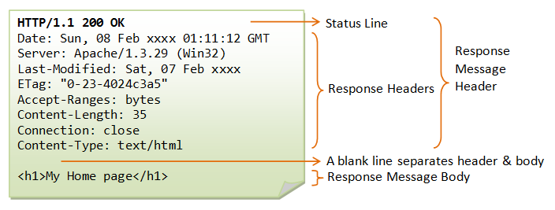

# HTTP网络协议相关

**URI**  
URI包含URL跟URN  
URI全称Uniform Resource Identifier 统一资源标识符  
URL全称Uniform Resource Locator 统一资源定位符  
URN全称Uniform Resource Name 统一资源名称  
看这中文名跟英文名就知道URI包含URL跟URN，懂的都懂，真的是给他懂完了。  

**请求报文和响应报文**  
请求报文的第一行是请求行，包含了方法字段。  
+ 请求报文 

 

+ 响应报文

**HTTP方法简单介绍**  
请求方法字段  
+ GET  
请求指定的页面信息，并返回实体主体
+ HEAD  
与GET请求类似，但不返回报文实体主体部分。  
主要用于确认URL的有效性以及资源的更新的日期时间等操作。
+ POST  
向指定资源提交数据进行处理请求（例如提交表单或者上传文件）。数据被包含在请求体中，POST请求可能会导致新的资源的建立和/或已有资源的修改。  
POST主要用来传输数据，而GET主要用来获取资源。
+ PUT  
从客户端向服务器传送的数据取代指定的文档的内容，自身并不带验证的机制，任何人都可以上传文件，存在安全性问题，一般不使用该方法。
+ DELETE  
请求服务器删除指定的页面，与PUT请求相反，同样不带验证机制。
+ PATCH  
对PUT方法的补充，对已知资源的进行局部更新。PUT只能完全替代，PATCH允许部分修改。
+ OPTIONS  
查询指定URL能够支持的方法  
返回Allow: GET, POST, HEAD, OPTIONS这样的内容
+ CONNECT  
HTTP/1.1 协议中预留给能够将连接改为管道方式的代理服务器。要求与代理服务器通信时建立隧道。  
使用SSL（Secure Socket Layer，安全套接层）和TLS（Transport Layer Security，传输层安全）协议把通信内容加密后经网络隧道传输。  

CONNECT www.example.com:443 HTTP/1.1  
看图解有点像webRtc?  

+ TRACE  
回显服务器收到的请求，主要用于测试或诊断。  
服务器把通信路径返回给客户端，通常不会用到TRACE，并且容易受到XST攻击(Cross-Site Tracing，跨站追踪)  

  
**GET和POST的区别**  
  
GET请求——从指定的URL中获取资源与数据
+ GET请求可以被缓存，可以保留在浏览器的历史记录中，可被收藏为书签  
+ GET请求时的结果幂等的（多次进行该运算的结果跟第一次进行的结果是一样的，就称为幂等）
+ GET有长度限制，在HTTP协议的定义中，没有对GET请求的大小进行限制，不过因为浏览器不一样，所以一般限制在2~8K  
+ GET请求的所有参数都被包装在URL中，服务器的访问日志会记录，不要传递敏感信息。  

POST请求——向指定的资源提交要被处理的数据
+ POST请求不会被缓存，不会保留在浏览器的历史历史记录中，不能被收藏为书签。
+ POST向服务器中发送数据，也可以获得服务器处理之后的结果，效率不如GET
+ POST提交的数据比较大，大小由服务器的设定值限制，PHP通常限定2M
+ POST提交的参数包装成二进制的数据体，格式与GET基本一致
+ URL中只有资源路径，但是不包含参数，服务器日志不会记录，相对更安全
+ 涉及用户隐私的数据（密码、银行卡号、身份证）一定要用POST方式传递。

**HTTP状态响应码**

服务器返回的   **响应报文**   中第一行为状态行，包含了状态码以及原因短语，用来告知客户端请求的结果。

| 状态码 | 类别 | 含义 |
| :---: | :---: | :---: |
| 1XX | Informational（信息性状态码） | 接收的请求正在处理 |
| 2XX | Success（成功状态码） | 请求正常处理完毕 |
| 3XX | Redirection（重定向状态码） | 需要进行附加操作以完成请求 |
| 4XX | Client Error（客户端错误状态码） | 服务器无法处理请求 |
| 5XX | Server Error（服务器错误状态码） | 服务器处理请求出错 |

**1XX 信息**

-   **100 Continue**  ：表明到目前为止都很正常，客户端可以继续发送请求或者忽略这个响应。

**2XX 成功**

-   **200 OK**  

-   **204 No Content**  ：请求已经成功处理，但是返回的响应报文不包含实体的主体部分。一般在只需要从客户端往服务器发送信息，而不需要返回数据时使用。

-   **206 Partial Content**  ：表示客户端进行了范围请求，响应报文包含由 Content-Range 指定范围的实体内容。

**3XX 重定向**

-   **301 Moved Permanently**  ：永久性重定向

-   **302 Found**  ：临时性重定向

-   **303 See Other**  ：和 302 有着相同的功能，但是 303 明确要求客户端应该采用 GET 方法获取资源。

- 注：虽然 HTTP 协议规定 301、302 状态下重定向时不允许把 POST 方法改成 GET 方法，但是大多数浏览器都会在 301、302 和 303 状态下的重定向把 POST 方法改成 GET 方法。

-   **304 Not Modified**  ：如果请求报文首部包含一些条件，例如：If-Match，If-Modified-Since，If-None-Match，If-Range，If-Unmodified-Since，如果不满足条件，则服务器会返回 304 状态码。

-   **307 Temporary Redirect**  ：临时重定向，与 302 的含义类似，但是 307 要求浏览器不会把重定向请求的 POST 方法改成 GET 方法。

**4XX 客户端错误**

-   **400 Bad Request**  ：请求报文中存在语法错误。

-   **401 Unauthorized**  ：该状态码表示发送的请求需要有认证信息（BASIC 认证、DIGEST 认证）。如果之前已进行过一次请求，则表示用户认证失败。

-   **403 Forbidden**  ：请求被拒绝。

-   **404 Not Found**  

**5XX 服务器错误**

-   **500 Internal Server Error**  ：服务器正在执行请求时发生错误。

-   **503 Service Unavailable**  ：服务器暂时处于超负载或正在进行停机维护，现在无法处理请求。