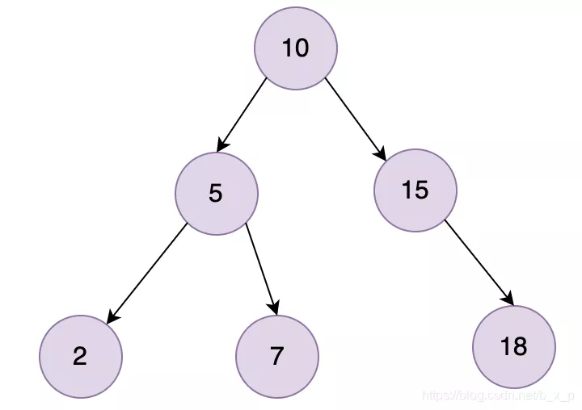
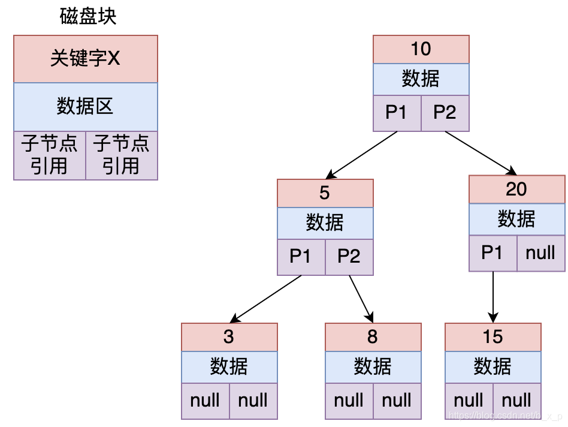
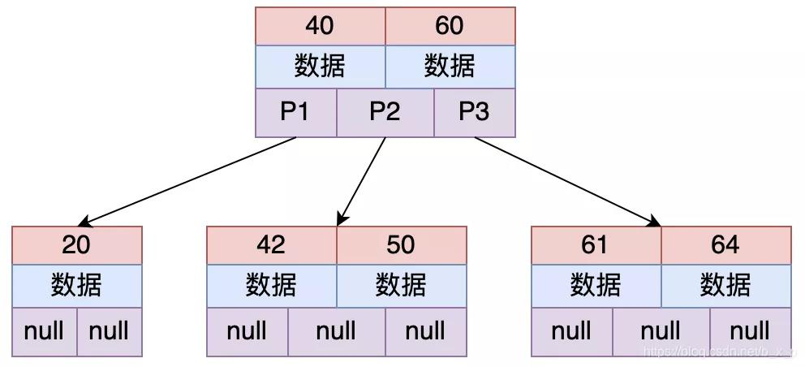

## MySQL基础相关

### MySQL索引  

<br>

#### 什么是索引以及其工作机制  

<br>

索引是为了加速表中数据行的检索而创建的一种分散存储的数据结构。如果有SQL语句**SELECT * FROM USER WHERE id = 40**，如果没有索引的条件下，我们要找到这条记录，我们就需要在数据中进行全表扫描，匹配id = 13的数据。  


如果有了索引，我们就可以通过索引进行快速查找。先在索引中通过id = 40进行二分查找，再根据定位到的地址取出对应的行数据。  


#### 为什么MySQL要用B+ Tree作为索引的数据结构?  

<br>

#### 二叉树为什么不可行  

对于数据的加速检索，首先想到的就是二叉树。

  

二叉树搜索相当于一个二分搜索。二叉查找能大大提升查询的效率，但它有一个问题：二叉树以第一个插入的数据作为根节点。如果只包含右侧，虽然是链表但是还是需要遍历所有节点才能找到，相当于全表扫描

#### 平衡二叉树为什么不可用  

为了解决上述问题，就会想到用平衡二叉树来解决  



平衡二叉树的定义:结点的子节点高点差不能超过1，上图的结点20，左节点高度为1，右节点高度为0，差为1，所以上图没有违反定义，它就是一个平衡二叉树。保证二叉树平衡的方式为左旋、右旋等操作。  


如果要查找id = 8的数据  

1. 把根结点加载到内存，用8和10进行比较，发现8比10小，继续加载10的左子树  
2. 把5加载进内存，用8和5进行比较，同理，加载5结点的右子树
3. 此时发现命中，则读取id为8的索引对应的数据  


索引保存数据的方式一般有两种：
+ 数据区保存id对应行的数据的所有数据具体内容  
+ 数据区保存的是真正保存数据的磁盘地址  

到这里，平衡二叉树解决了存在线性链表的问题，数据查询的效率好像也还可以，基本能达到O(log2(n))， 那为什么mysql不选择平衡二叉树作为索引存储结构，他又存在什么样的问题呢？  


1. 搜索效率不足。数据的深度是决定了搜索时的IO次数（MySql中将每个节点大小设置为一页大小，一次IO读取一页 / 一个节点）。如上图中搜索id = 8的数据，需要进行3次IO。当数据量到达几百万的时候，树的高度就会很恐怖。


2. 查询不稳定。如果查询的数据落在根结点，只需要一次IO，如果是叶子结点或者是子节点，会需要多次IO才可以。  

3. 存储的数据内容太少。没有很好的利用操作系统和磁盘数据交换特性。也没有利用好磁盘IO的预读能力。因为操作系统和磁盘之间一次数据交换是以页为单位的，一页大小为4K，即每次IO操作系统会将4K数据加载进内存。但是，在二叉树每个节点的结构只保存一个关键字，一个数据区，两个子节点的引用，并不能够填满4K的内容。辛辛苦苦做了一次IO操作却只加载了一个关键字。在树的高度很高，恰好有搜索的关键字位于叶子结点或者子节点的时候，去一个关键字要做很多次的IO

那么有没有一种结构可以解决这种问题呢？有，多路平衡二叉查找树


### 多路平衡查找树(Balance Tree)

B Tree是一个绝对平衡树，所有的叶子结点都在同一高度

  

上图为一个2-3树（每个节点存储2个关键字，有3路），多路平衡查找树也就是多叉的意思，从上图中可以看出，每个节点保存的关键字的个数和路数关系为：关键字个数 = 路数 – 1。

假设要从上图中查找id = X的数据，B TREE 搜索过程如下：

1. 取出根磁盘块，加载40和60两个关键字。
2. 如果X等于40，则命中；如果X小于40走P1；如果40 < X < 60走P2；如果X = 60，则命中；如果X > 60走P3。
3. 根据以上规则命中后，接下来加载对应的数据， 数据区中存储的是具体的数据或者是指向数据的指针。  


为什么说这种结构能够解决平衡二叉树存在的问题呢？  

B Tree 能够很好的利用操作系统和磁盘的交互特性， MySQL为了很好的利用磁盘的预读能力，将页大小设置为16K，即将一个节点（磁盘块）的大小设置为16K，一次IO将一个节点（16K）内容加载进内存。这里，假设关键字类型为 int，即4字节，若每个关键字对应的数据区也为4字节，不考虑子节点引用的情况下，则上图中的每个节点大约能够存储（16 * 1000）/ 8 = 2000个关键字，共2001个路数。对于二叉树，三层高度，最多可以保存7个关键字，而对于这种有2001路的B树，三层高度能够搜索的关键字个数远远的大于二叉树。  

这里顺便说一下：在B Tree保证树的平衡的过程中，每次关键字的变化，都会导致结构发生很大的变化，这个过程是特别浪费时间的，所以创建索引一定要创建合适的索引，而不是把所有的字段都创建索引，创建冗余索引只会在对数据进行新增，删除，修改时增加性能消耗。  

B树确实已经很好的解决了问题，我先这里先继续看一下B+Tree结构，再来讨论BTree和B+Tree的区别。

先看看B+Tree是怎样的，B+Tree是B Tree的一个变种，在B+Tree中，B树的路数和关键字的个数的关系不再成立了，数据检索规则采用的是左闭合区间，路数和关键个数关系为1比1，具体如下图所示：  


  

如果上图中是用ID做的索引，如果是搜索X = 1的数据，搜索规则如下：

+ 取出根磁盘块，加载1，28，66三个关键字。
+ X <= 1 走P1，取出磁盘块，加载1，10，20三个关键字。
+ X <= 1 走P1，取出磁盘块，加载1，8，9三个关键字。
+ 已经到达叶子节点，命中1，接下来加载对应的数据，图中数据区中存储的是具体的数据。

### B TREE和B+TREE区别是什么？  

+ B+Tree 关键字的搜索采用的是左闭合区间，之所以采用左闭合区间是因为他要最好的去支持自增id，这也是mysql的设计初衷。即，如果id = 1命中，会继续往下查找，直到找到叶子节点中的1。
+ B+Tree 根节点和子节点没有数据区，关键字对应的数据只保存在叶子节点中。即只有叶子节点中的关键字数据区才会保存真正的数据内容或者是内容的地址。而在B树中，如果根节点命中，则会直接返回数据。
+ 在B+Tree中，叶子节点不会去保存子节点的引用。
+ B+Tree叶子节点是顺序排列的，并且相邻的节点具有顺序引用的关系，如上图中叶子节点之间有指针相连接。


### MySQL为什么最终要去选择B+Tree？  

+ B+Tree是B TREE的变种，B TREE能解决的问题，B+TREE也能够解决（降低树的高度，增大节点存储数据量）
+ B+Tree扫库和扫表能力更强。如果我们要根据索引去进行数据表的扫描，对B TREE进行扫描，需要把整棵树遍历一遍，而B+TREE只需要遍历他的所有叶子节点即可（叶子节点之间有引用）。
+ B+TREE磁盘读写能力更强。他的根节点和支节点不保存数据区，所以根节点和支节点同样大小的情况下，保存的关键字要比B TREE要多。而叶子节点不保存子节点引用，能用于保存更多的关键字和数据。所以，B+TREE读写一次磁盘加载的关键字比B TREE更多。
+ B+Tree排序能力更强。上面的图中可以看出，B+Tree天然具有排序功能。
+ B+Tree查询性能稳定。B+Tree数据只保存在叶子节点，每次查询数据，查询IO次数一定是稳定的。当然这个每个人的理解都不同，因为在B TREE如果根节点命中直接返回，确实效率更高。


### MYISAM和InnoDB的实现


进入mysql终端执行

```sql
show variables like '%datadir%'
```
  

进入到这个目录下，这个目录下保存的是所有数据库，再进入到具体的一个数据库目录下。就能够看到MySQL存储数据和索引的文件了。

这里我创建了两张表，user_innod和user_myisam，分别指定索引为innodb和myisam。对于每张表，MySQL会创建相应的文件保存数据和索引。


MYISAM存储引擎存储数据库数据，一共有三个文件:
+ Frm: 表的定义文件
+ MYD: 数据文件，所有的数据保存在这个文件中
+ MYI：索引文件

Innodb存储引擎存储数据库数据，一共有两个文件(没有专门保存数据的文件)：

+ Frm: 表的定义文件  
+ Ibd文件: 数据和索引存储文件。数据以主键进行聚集存储，把真正的数据保存在叶子结点中。


### MyISAM存储引擎  


