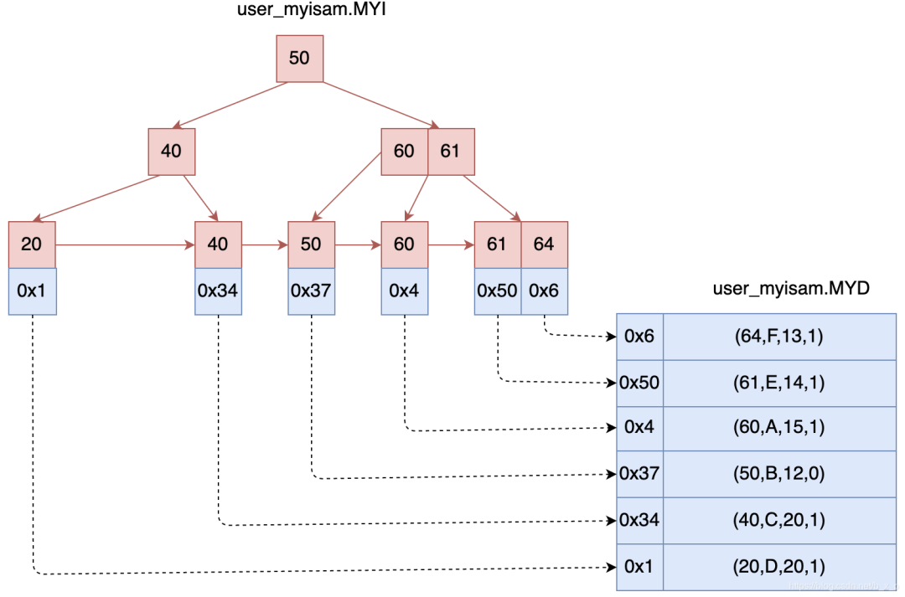
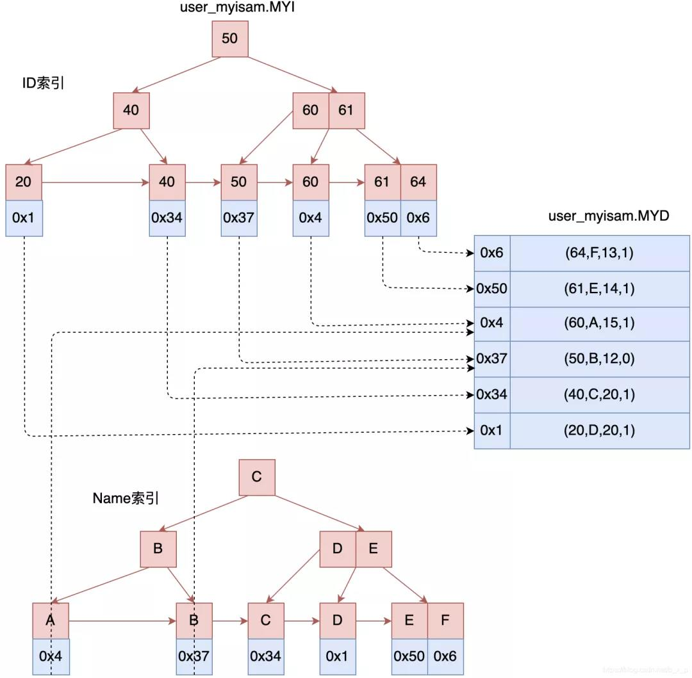
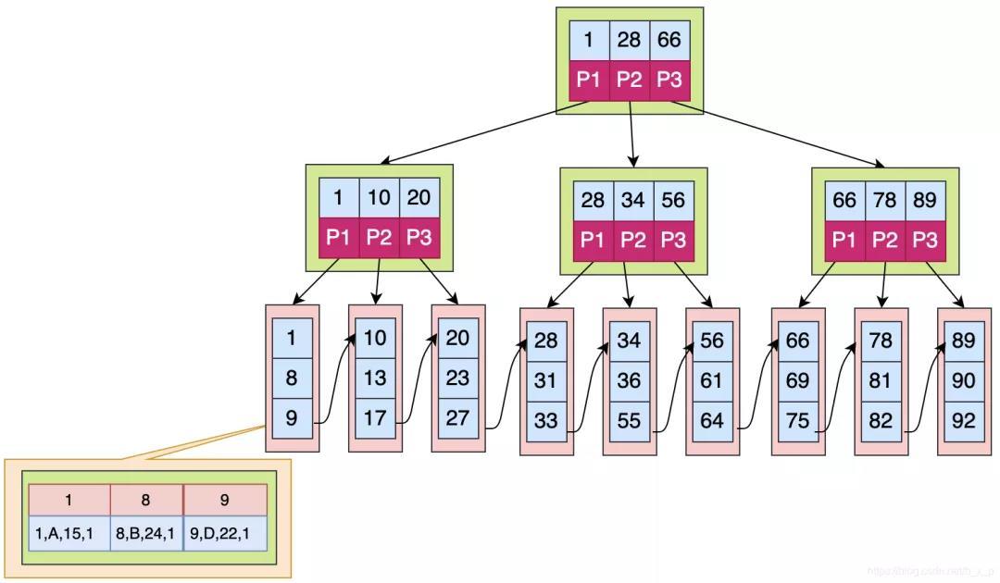
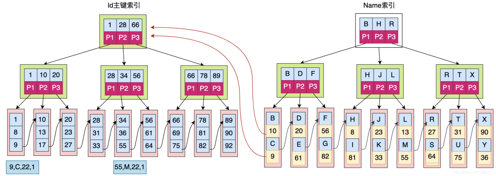
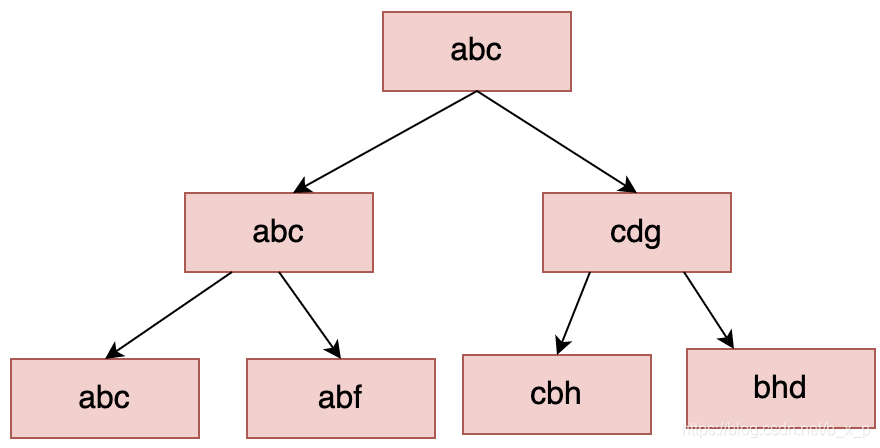

```sql
DELIMITER $$ 
```
结束符是$$  


## MySQL基础相关

### MySQL索引  

<br>

#### 什么是索引以及其工作机制  


<br>

索引是为了加速表中数据行的检索而创建的一种分散存储的数据结构。如果有SQL语句**SELECT * FROM USER WHERE id = 40**，如果没有索引的条件下，我们要找到这条记录，我们就需要在数据中进行全表扫描，匹配id = 13的数据。  


如果有了索引，我们就可以通过索引进行快速查找。先在索引中通过id = 40进行二分查找，再根据定位到的地址取出对应的行数据。  


#### 为什么MySQL要用B+ Tree作为索引的数据结构?  

<br>

#### 二叉树为什么不可行  

对于数据的加速检索，首先想到的就是二叉树。

  

二叉树搜索相当于一个二分搜索。二叉查找能大大提升查询的效率，但它有一个问题：二叉树以第一个插入的数据作为根节点。如果只包含右侧，虽然是链表但是还是需要遍历所有节点才能找到，相当于全表扫描

#### 平衡二叉树为什么不可用  

为了解决上述问题，就会想到用平衡二叉树来解决  


平衡二叉树的定义:结点的子节点高点差不能超过1，上图的结点20，左节点高度为1，右节点高度为0，差为1，所以上图没有违反定义，它就是一个平衡二叉树。保证二叉树平衡的方式为左旋、右旋等操作。  


如果要查找id = 8的数据  

1. 把根结点加载到内存，用8和10进行比较，发现8比10小，继续加载10的左子树  
2. 把5加载进内存，用8和5进行比较，同理，加载5结点的右子树
3. 此时发现命中，则读取id为8的索引对应的数据  


索引保存数据的方式一般有两种：
+ 数据区保存id对应行的数据的所有数据具体内容  
+ 数据区保存的是真正保存数据的磁盘地址  

到这里，平衡二叉树解决了存在线性链表的问题，数据查询的效率好像也还可以，基本能达到O(log2(n))， 那为什么mysql不选择平衡二叉树作为索引存储结构，他又存在什么样的问题呢？  


1. 搜索效率不足。数据的深度是决定了搜索时的IO次数（MySql中将每个节点大小设置为一页大小，一次IO读取一页 / 一个节点）。如上图中搜索id = 8的数据，需要进行3次IO。当数据量到达几百万的时候，树的高度就会很恐怖。


2. 查询不稳定。如果查询的数据落在根结点，只需要一次IO，如果是叶子结点或者是子节点，会需要多次IO才可以。  

3. 存储的数据内容太少。没有很好的利用操作系统和磁盘数据交换特性。也没有利用好磁盘IO的预读能力。因为操作系统和磁盘之间一次数据交换是以页为单位的，一页大小为4K，即每次IO操作系统会将4K数据加载进内存。但是，在二叉树每个节点的结构只保存一个关键字，一个数据区，两个子节点的引用，并不能够填满4K的内容。辛辛苦苦做了一次IO操作却只加载了一个关键字。在树的高度很高，恰好有搜索的关键字位于叶子结点或者子节点的时候，去一个关键字要做很多次的IO

那么有没有一种结构可以解决这种问题呢？有，多路平衡二叉查找树


### 多路平衡查找树(Balance Tree)

B Tree是一个绝对平衡树，所有的叶子结点都在同一高度

  

上图为一个2-3树（每个节点存储2个关键字，有3路），多路平衡查找树也就是多叉的意思，从上图中可以看出，每个节点保存的关键字的个数和路数关系为：关键字个数 = 路数 – 1。

假设要从上图中查找id = X的数据，B TREE 搜索过程如下：

1. 取出根磁盘块，加载40和60两个关键字。
2. 如果X等于40，则命中；如果X小于40走P1；如果40 < X < 60走P2；如果X = 60，则命中；如果X > 60走P3。
3. 根据以上规则命中后，接下来加载对应的数据， 数据区中存储的是具体的数据或者是指向数据的指针。  


为什么说这种结构能够解决平衡二叉树存在的问题呢？  

B Tree 能够很好的利用操作系统和磁盘的交互特性， MySQL为了很好的利用磁盘的预读能力，将页大小设置为16K，即将一个节点（磁盘块）的大小设置为16K，一次IO将一个节点（16K）内容加载进内存。这里，假设关键字类型为 int，即4字节，若每个关键字对应的数据区也为4字节，不考虑子节点引用的情况下，则上图中的每个节点大约能够存储（16 * 1000）/ 8 = 2000个关键字，共2001个路数。对于二叉树，三层高度，最多可以保存7个关键字，而对于这种有2001路的B树，三层高度能够搜索的关键字个数远远的大于二叉树。  

这里顺便说一下：在B Tree保证树的平衡的过程中，每次关键字的变化，都会导致结构发生很大的变化，这个过程是特别浪费时间的，所以创建索引一定要创建合适的索引，而不是把所有的字段都创建索引，创建冗余索引只会在对数据进行新增，删除，修改时增加性能消耗。  

B树确实已经很好的解决了问题，我先这里先继续看一下B+Tree结构，再来讨论BTree和B+Tree的区别。

先看看B+Tree是怎样的，B+Tree是B Tree的一个变种，在B+Tree中，B树的路数和关键字的个数的关系不再成立了，数据检索规则采用的是左闭合区间，路数和关键个数关系为1比1，具体如下图所示：  


  

如果上图中是用ID做的索引，如果是搜索X = 1的数据，搜索规则如下：

+ 取出根磁盘块，加载1，28，66三个关键字。
+ X <= 1 走P1，取出磁盘块，加载1，10，20三个关键字。
+ X <= 1 走P1，取出磁盘块，加载1，8，9三个关键字。
+ 已经到达叶子节点，命中1，接下来加载对应的数据，图中数据区中存储的是具体的数据。

### B TREE和B+TREE区别是什么？  

+ B+Tree 关键字的搜索采用的是左闭合区间，之所以采用左闭合区间是因为他要最好的去支持自增id，这也是mysql的设计初衷。即，如果id = 1命中，会继续往下查找，直到找到叶子节点中的1。
+ B+Tree 根节点和子节点没有数据区，关键字对应的数据只保存在叶子节点中。即只有叶子节点中的关键字数据区才会保存真正的数据内容或者是内容的地址。而在B树中，如果根节点命中，则会直接返回数据。
+ 在B+Tree中，叶子节点不会去保存子节点的引用。
+ B+Tree叶子节点是顺序排列的，并且相邻的节点具有顺序引用的关系，如上图中叶子节点之间有指针相连接。


### MySQL为什么最终要去选择B+Tree？  

+ B+Tree是B TREE的变种，B TREE能解决的问题，B+TREE也能够解决（降低树的高度，增大节点存储数据量）
+ B+Tree扫库和扫表能力更强。如果我们要根据索引去进行数据表的扫描，对B TREE进行扫描，需要把整棵树遍历一遍，而B+TREE只需要遍历他的所有叶子节点即可（叶子节点之间有引用）。
+ B+TREE磁盘读写能力更强。他的根节点和支节点不保存数据区，所以根节点和支节点同样大小的情况下，保存的关键字要比B TREE要多。而叶子节点不保存子节点引用，能用于保存更多的关键字和数据。所以，B+TREE读写一次磁盘加载的关键字比B TREE更多。
+ B+Tree排序能力更强。上面的图中可以看出，B+Tree天然具有排序功能。
+ B+Tree查询性能稳定。B+Tree数据只保存在叶子节点，每次查询数据，查询IO次数一定是稳定的。当然这个每个人的理解都不同，因为在B TREE如果根节点命中直接返回，确实效率更高。


### MYISAM和InnoDB的实现


进入mysql终端执行

```sql
show variables like '%datadir%'
```
  

进入到这个目录下，这个目录下保存的是所有数据库，再进入到具体的一个数据库目录下。就能够看到MySQL存储数据和索引的文件了。

这里我创建了两张表，user_innod和user_myisam，分别指定索引为innodb和myisam。对于每张表，MySQL会创建相应的文件保存数据和索引。


MYISAM存储引擎存储数据库数据，一共有三个文件:
+ Frm: 表的定义文件
+ MYD: 数据文件，所有的数据保存在这个文件中
+ MYI：索引文件

Innodb存储引擎存储数据库数据，一共有两个文件(没有专门保存数据的文件)：

+ Frm: 表的定义文件  
+ Ibd文件: 数据和索引存储文件。数据以主键进行聚集存储，把真正的数据保存在叶子结点中。


### MyISAM存储引擎  

在MYISAM存储引擎中，数据和索引的关系如下：
  

### 如何查找数据？  

如果要查找id=40的数据：先根据MyISAM索引文件(如上图)去找id=40的节点，通过这个节点的数据区拿到真正保存数据的磁盘地址，再通过这个地址从MYD数据文件(如上图右)中加载对应的记录。  

如果有多个索引，表现形式如下：  

  

由图可知MYISAM存储引擎中，主键索引和辅助索引是同级别的，没有主次之分。  


### Innodb存储引擎  

Innodb主键索引为聚集索引，聚集索引概念：数据库表行中数据的物理顺序和键值的逻辑顺序相同。  

Innodb以主键索引来聚集组织数据的存储，下面看看Innodb是如何组织数据的。  

  

如上图中，叶子节点的数据区保存的就是真实的数据，在通过索引进行检索的时候，命中叶子节点，就可以直接从叶子节点中取出行数据。mysql5.5版本之前默认采用的是MyISAM引擎，5.5之后默认采用的是innodb引擎。  

Innodb中，辅助索引的格式如下图所示：  

  

主键索引的叶子节点保存的是真正的数据。而辅助索引叶子节点的数据区保存的是主键索引关键字的值   

假如要查询name = C的数据，搜索过程如下:  

1. 先在辅助索引中通过C查询最后找到主键id=9
2. 在主键索引中搜索id为9的数据，最后在主键索引的叶子节点中获取到真正的数据。  

所以通过辅助索引进行检索，需要检索两次索引。  

之所以这样设计，一个原因就是：如果和MyISAM一样在主键索引和辅助索引的叶子节点中都存放数据行指针，一旦数据发生迁移，则需要去重新组织维护所有的索引。  

## 创建索引的几大原则

### 列的离散型  

离散型的计算公式:

```sql
count(distinct column_name):count(*)
```
用去重后的列值个数比个数。离散型越高，选择型越好。  

因为离散度越高，通过索引最终确定的范围越小，最终扫描的行数也越少。  

### 最左匹配原则  

对于索引中的关键字进行对比的时候，一定是从左往右以此对比，且不可跳过。之前讲解的id都为int型数据，如果id为字符串的时候，如下图：  

  

当进行匹配的时候，会把字符串转换成ascII码，如abc会变成 97 98 99，然后从左往右一个字符一个字符进行对比。所以在sql查询中使用like %a 时候索引会失效，因为%表示全匹配，如果已经全匹配就不需要索引，还不如直接全表扫描。  

### 最少空间原则

前面已经说过，当关键字占用的空间越小，则每个节点保存的关键字个数就越多，每次加载进内存的关键字个数就越多，检索效率就越高。创建索引的关键字要尽可能占用空间小  


### 联合索引  
+ 单列索引：节点中的关键字[name]
+ 联合索引：节点中的关键字[name,age]  

可以把单列索引看成特殊的联合索引，联合索引的比较也是根据最左匹配原则。  


### 联合索引的选择原则

+ 经常用的列优先(最左匹配原则)
+ 离散度高的列优先(离散度高原则)  
+ 宽度小的列优先(最少空间原则)  

实例分析：  
假设经常使用的查询sql如下：  

```sql
select * from users where name = ?;
select * from users where name = ? and age = ?;
```

为了加快检索速度，为上面的查询sql创建索引如下:  

```sql
create index idx_name on users(name);
create index idx_name_age on users(name,age);
```
在上面解决方案中，根据最左匹配原则，idx_name为冗余索引，where name = ? 同样可以利用索引idx_name_age 进行检索。冗余索引会增加维护B+Tree平衡时的性能消耗，并且占用磁盘空间。  


### 覆盖索引  

如果查询的列，通过索引项的信息可以直接返回，则该索引称之为查询sql的覆盖索引，覆盖索引可以提高查询的效率。  

如果通过name进行数据检索：  

```sql
select * from users where name = ?
```
需要在name索引中找到name对应的id，然后通过获取的id在主键索引中查到对应的行，整个过程需要扫描两次索引，一次name，一次id  


如果我们查询只想查询id的值，就可以改写sql为：  

```sql
select id from users where name = ?
```
因为只需要id的值，通过name查询的时候，扫描完name索引，我们就能够获得id的值了，所以就不需要再去扫面id索引，就会直接返回。

当然，如果你同时需要获取age的值：


```sql
select id, age from user where name = ?
```

这样就无法使用到覆盖索引了。

知道了覆盖索引，就知道了为什么sql中要求尽量不要使用select *，要写明具体要查询的字段。其中一个原因就是在使用到覆盖索引的情况下，不需要进入到数据区，数据就能直接返回，提升了查询效率。在用不到覆盖索引的情况下，也尽可能的不要使用select *，如果行数据量特别多的情况下，可以减少数据的网络传输量。当然，这都视具体情况而定，通过select返回所有的字段，通用性会更强，一切有利必有弊。  


## 总结

+ 索引列的数据长度满足业务的情况下能少则少。
+ 表中的索引并不是越多越好，冗余或者无用索引会占用磁盘空间并且会影响增删改的效率。
+ Where 条件中，like 9%， like %9%， like%9，三种方式都用不到索引。后两种方式对于索引是无效的。第一种9%是不确定的，决定于列的离散型，结论上讲可以用到，如果发现离散情况特别差的情况下，查询优化器觉得走索引查询性能更差，还不如全表扫描。
+ Where条件中IN可以使用索引， NOT IN 无法使用索引。
+ 多用指定查询，只返回自己想要的列，少用select *。
+ 查询条件中使用函数，索引将会失效，这和列的离散性有关，一旦使用到函数，函数具有不确定性。
+ 联合索引中，如果不是按照索引最左列开始查找，无法使用索引。
+ 对联合索引精确匹配最左前列并范围匹配另一列，可以使用到索引。
+ 联合索引中，如果查询有某个列的范围查询，其右边所有的列都无法使用索引。

