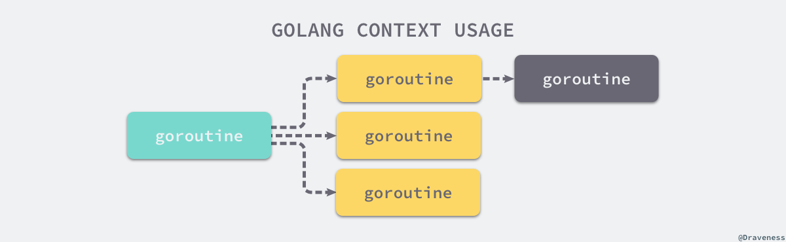

## 上下文Context  

上下文context.Context是Go语言用来设置截止日期、同步信号，传递请求相关值的结构体。上下文与Goroutine有比较密切的关系，是Go语言中独特的设计，在其他编程语言中我们很少见类似的概念

contex.Context是Go语言在1.7版本中引入标准库的接口，结构如下:  

```go
type Context interface {
	Deadline() (deadline time.Time, ok bool)
	Done() <-chan struct{}
	Err() error
	Value(key interface{}) interface{}
}
```

1. Deadline--返回context.Context被取消的时间，也就是完成工作的截至日期  
2. Done--返回一个Channel，这个Channel会在当前工作完成或者上下文被取消后关闭，多次调用Done方法会返回同一个Channel  
3. Err--返回context.Context结束的原因，它只会在Done方法对应的Channel关闭时返回非空的值  
   1)如果context.Context被取消，会返回Canceled错误  
   2)如果context.Context超时，会返回DeadlineExceeded错误  
4. Value--从context.Context中获取键对应的值，对同一个上下文来说，多次调用Value并传入相同的Key会返回相同的结果，该方法可以用来传递请求特定的数据  

context包中还提供context.Background、context.TODO、context.WithDeadline和context.WithValue函数，他们会返回实现该接口的私有结构体  


## 设计原理  

在goroutine构成的树形结构中对信号进行同步以减少计算资源的浪费是context.Context的最大作用。Go服务的每一个请求都是通过单独的goroutine处理的，HTTP/RPC请求的处理器会启动新的Goroutine访问数据库和其他服务。  

如下图所示，我们可能会创建多个Goroutine来处理一次请求，而context.Context的作用是在不同Goroutine之间同步请求特定数据、取消信号以及处理请求的截止日期  

  

每一个context.Context都会从最顶层的Goroutine一层一层传递到最下层。context.Context可以在上层Goroutine执行出现错误时，将信号及时同步给下层  
  

如上图所示，当最上层的Goroutine因为某些原因执行失败时，下层的Goroutine由于没有接收到这个信号所以会继续工作；但是当我们正确地使用context.Context时，就可以在下层及时停掉无用的工作以减少额外资源的消耗  

在下面举一个例子来了解context.Context是如何对信号进行同步的。在这段代码中，我们创建了一个过期时间为1s的上下文，并向上下文传入handle函数，该方法会使用500ms的时间处理传入的请求  

```go
func main() {
	ctx, cancel := context.WithTimeout(context.Background(), 1*time.Second)
	defer cancel()
	go handle(ctx, 500*time.Millisecond)
	select {
	case <-ctx.Done():
		fmt.Println("main", ctx.Err())
	}
}

func handle(ctx context.Context, duration time.Duration) {
	select {
	case <-ctx.Done():
		fmt.Println("handle", ctx.Err())
	case <-time.After(duration):
		fmt.Println("process request with", duration)
	}
}
```

因为过期时间大于处理时间，所以我们有足够的时间处理该请求，运行上述代码会打印出下面的内容:  

```terminal
process request with 500ms
main context deadline exceeded
```

handle函数没有进入到超时的select分支，但是main函数的select却会等待context.Context超时并打印出main context deadline exceeded  

如果我们将请求时间增加到1500ms，整个程序都会因为上下文的过期而被终止  

**有概率main先收到协程被取消，因为main 协程已经退出了，handle 被强制退出了**  

```terminal
handle context deadline exceeded
main context deadline exceeded
```
