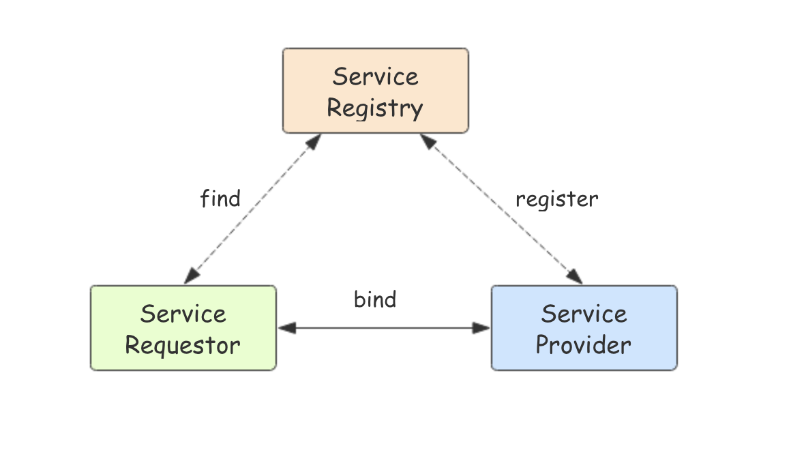
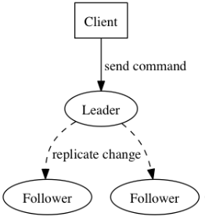
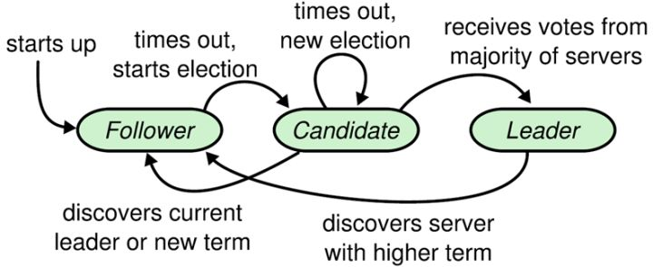
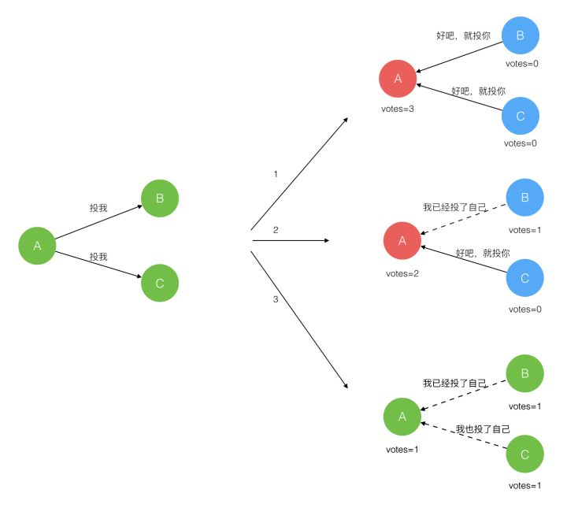
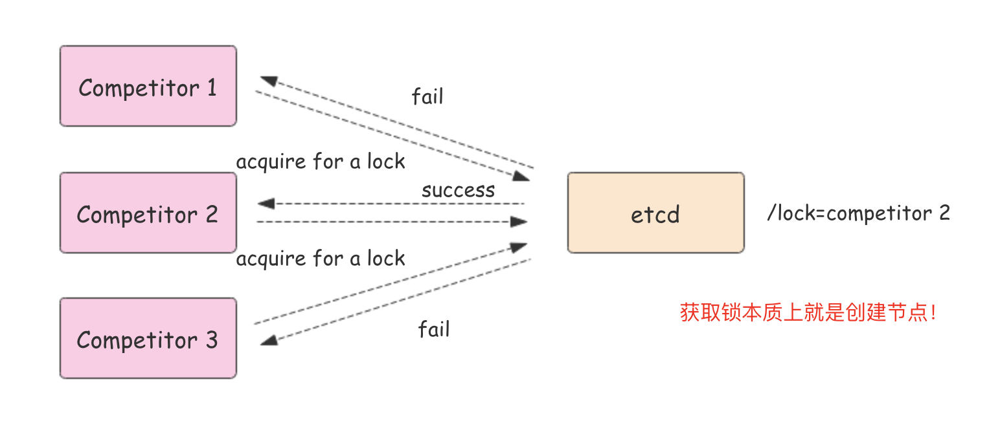

# etcd  
etcd是一个开源的分布式键值对数据存储系统，提供共享配置、服务的注册和发现。  

## etcd介绍  
etcd是使用go语言开发的一个开源的、高可用的分布式key-value存储系统，可以用于配置共享和服务的注册和发现。  
etcd具有以下特点：  
+ 完全复制：集群中的每个节点都可以使用完整的存档
+ 高可用性：etcd可用于避免硬件的单点故障或网络问题  
+ 一致性：每次读取都会返回跨多主机的最新写入  
+ 简单：包括一个定义良好、面向用户的API(gRPC)
+ 安全：实现了带有可选客户端证书身份验证的自动化TLS
+ 快速：每秒10000次的写入基准速度  
+ 可靠：使用Raft算法实现强一致、高可用的服务存储目录  

## etcd应用场景  
服务发现要解决的问题是分布式系统最常见的问题之一，在同一个分布式集群中的进程或服务，如何才能找到对方并建立连接。  
本质上，服务发现就是想要了解集群中是否有进程在监听udp或tcp端口，并且通过名字就可以查找和连接。  

## 配置中心  
将一些配置信息放到etcd上进行集中管理  
这类场景的使用方式通常是这样：应用在启动的时候主动从etcd获取一次配置信息，同时，在etcd节点上注册一个Watcher并等待，以后每次配置有更新的时候，etcd都会实时通知订阅者，以此达到获取最新配置信息的目的。  

## 分布式锁  
因为etcd使用Raft算法保持数据的强一致性，，某次操作存储到集群中的值必然是全局一致的，所以很容易实现分布式锁。锁服务有两种使用方式，一是保持独占，二是控制时序。  

---

### Raft算法概述  
Raft将系统中的角色分为领导者（Leader）、跟从者（Follower）和候选人（Candidate）：  

+ Leader: 接受客户端请求，并向Follower同步请求日志，当日志同步到大多数节点上后告诉Follower提交日志。
+ Follower: 接受并持久化Leader同步的日志，在Leader告知日志可以提交后，提交日志。
+ Candidate: Leader选举过程中的临时角色。  

Raft要求系统在任意时刻最多只有一个Leader，正常工作期间只有Leader和Follower

Raft算法角色状态转换如下：

Follower只响应其他服务器的请求。如果Follower超时没有收到Leader的消息，它会成为一个Candidate并且开始一次Leader选举。收到大多数服务器投票的Candidate会成为新的Leader。  
Leader在宕机之前会一直保持Leader的状态。  

  

Raft算法将时间分为一个个的任期(term)，每一个term的开始都是Leader选举。在成功选举Leader之后，Leader会在整个term管理整个集群。如果Leader选举失败，该term就会因为没有leader二结束

### Leader选举  
Raft使用心跳触发(heartbeat)触发Leader选举。当服务器启动时，初始化为Follower。Leader向所有Followers周期性发送heartbeat。如果Follower在选举超时时间内没有收到Leader的heartbeat，就会等待一段随机的时间后发起一次Leader选举。  

Follower将其当前term加一然后转换为Candidate。它首先给自己投票并且给集群中的其他服务器发送RequestVote RPC，结果有以下三种情况  

+ 赢得了多数的选票，成功选举为Leader
+ 收到了Leader的消息，表示有其他服务器已经抢先当选了Leader
+ 么有服务器赢得多数的选票，Leader选举失败，等待选举时间超市后发起下一次选举。 

  

选举出Leader后，Leader通过定期向所有Followers发送心跳信息维持其统治。若Follower一段时间未收到Leader的心跳则认为Leader可能已经挂了，再次发起Leader选举过程。  

---

+ 保持独占即所有获取锁的用户最终只有一个可以得到。etcd为此提供了一套实现分布式锁原子操作CAS(CompareAndSwap)的API。通过设置prevExist值，可以保证在多个节点同时去创建某个目录时，只有一个成功。而创建成功的用户就可以认为是获得了锁。

+ 控制时序，即所有想要获得锁的用户都会被安排执行，但是获得锁的顺序也是全局唯一的，同时决定了执行顺序。etcd为此也提供了一套API(自动创建有序键)，对一个目录键值时指定为POST动作，这样etcd会自动在目录下生成一个当前最大的值为键，存储这个新的值(客户端编号)。同时还可以使用API按顺序列出所有当前目录下的键值。此时这些键的值就是客户端的时序，而这些键中存储的值可以代表是客户端的编号
  

---

## 为什么用 etcd 而不用ZooKeeper？
etcd 实现的这些功能，ZooKeeper都能实现。那么为什么要用 etcd 而非直接使用ZooKeeper呢？

### 为什么不选择ZooKeeper？
部署维护复杂，其使用的Paxos强一致性算法复杂难懂。官方只提供了Java和C两种语言的接口。
使用Java编写引入大量的依赖。运维人员维护起来比较麻烦。
最近几年发展缓慢，不如etcd和consul等后起之秀。  

### 为什么选择etcd？
1. 简单。使用 Go 语言编写部署简单；支持HTTP/JSON API,使用简单；使用 Raft 算法保证强一致性让用户易于理解。
2. etcd 默认数据一更新就进行持久化。
3. etcd 支持 SSL 客户端安全认证。  

最后，etcd 作为一个年轻的项目，正在高速迭代和开发中，这既是一个优点，也是一个缺点。优点是它的未来具有无限的可能性，缺点是无法得到大项目长时间使用的检验。然而，目前 CoreOS、Kubernetes和CloudFoundry等知名项目均在生产环境中使用了etcd，这些项目都是老懂哥了  

