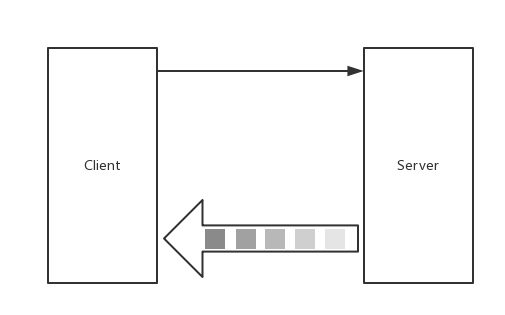

# Server-side streaming RPC : 服务流式RPC  



## Server  
```go
func (s *StreamService) List(r *pb.StreamRequest, stream pb.StreamService_ListServer) error {
    for(n := 0; n <= 6; n++) {
        Pt: &pb.StreamPoint{
            ...
        }
    }
    return nil
}
```

Client


```go
func printList(client pb.StreamServiceClient, r *pb.StreamRequest) error {
    stream, err := client.List(context.Background(), r)
    ...

    for {
        resp, err := stream.Recv()
        if err == io.EOF {
            break
        }
    }
    return nil
}
```