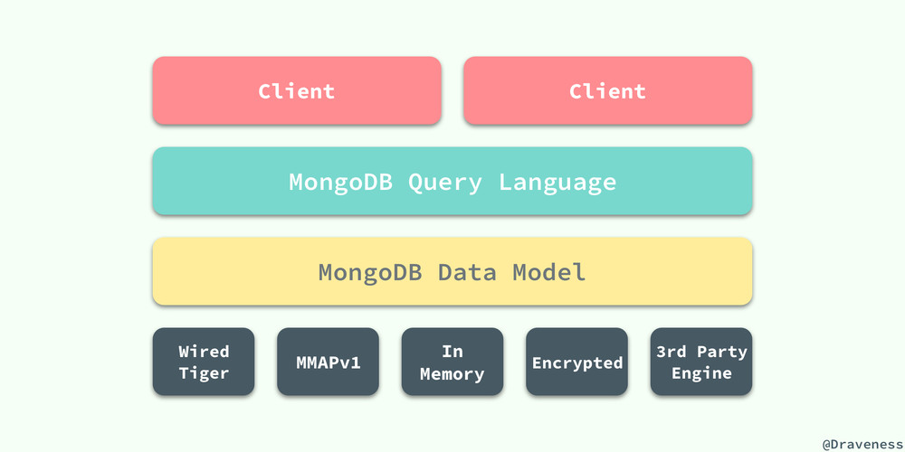
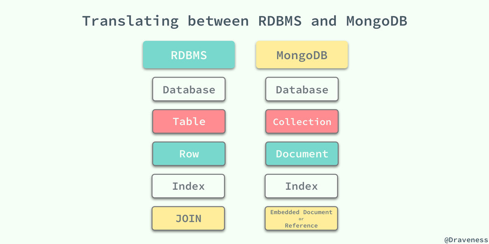
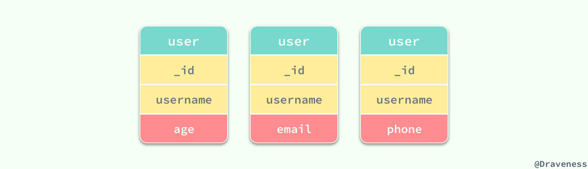

文章摘自： https://draveness.me/mongodb-wiredtiger/

# MongoDB

MongoDB是目前主流的NoSQL数据库之一，与关系型数据库和其他的NoSQL不同，MongoDB使用了面向文档的数据存储方式，将数据以类似JSON的方式存储在磁盘上  

## 概述  
MongoDB虽然也是数据库，但是与传统的RDBMS相比有着巨大的不同，很多开发者都认为或者被灌输一种思想，MongoDB这种无Scheme的数据库相比RDBMS有着巨大的性能提升，这个判断其实是一种误解，因为数据库的性能不止和业务有着巨大的关系，如果认为仅进行了数据库的替换就能得到数量级的性能提升，那还是too young too simple  

## 架构  
现有流行的数据库其实都有着非常相似的架构，MongoDB其实就与MySQL中的架构差不多，底层都使用了『可插拔』的存储引擎以满足用户的不同需求。  
  

用户可以根据表中的数据特征选择不同的存储引擎，他们可以在同一个MongoDB的实例中使用；在最新版本的MongoDB中使用了WiredTiger作为默认的存储引擎，WiredTiger提供了不同粒度的并发控制和压缩机制，能够为不同种类的应用提供了最好的性能和存储效率  

在不同存储引擎上层的就是MongoDB的数据模型和查询语言了，与关系型数据库不同，由于MongoDB对数据的存储与RDBMS有较大的差异，所以它创建了一套不同的查询语言；虽然MongoDB查询语言非常强大，支持的功能也很多，同时也是可编程的，不过其中包含的内容非常繁杂、API设计也不是非常优雅，所以还是需要一些学习成本的，长时间使用MySQL的开发者肯定是很难受的，比如我  

查询语言的复杂是因为MongoDB支持了很多数据类型，同时每一条数据记录也就是文档有着非常复杂的结构，这点从设计上就没有办法去避免的，所以还需要使用MongoDB的开发者花一些时间去学习各种各样的API(555爷哭了)   

## RDBMS与MongoDB  
MongoDB使用面向文档的数据模型，导致很多概念都与RDBMS有一些差别，虽然从总体上来看两者都有对应的概念，不过概念之间的细微的差别也会影响我们对MongoDB的理解  

  

传统的RDBMS其实使用Table的格式将数据逻辑地存储在一张二维的表中，其中不包括任何复杂的数据结构，但是由于MongoDB支持嵌入文档、数组和哈希等多种复杂数据结构的使用，所以它最终将所有的数据以BSON的数据格式存储起来。  

RDBMS和MongoDB中的概念都有着相互对应的关系，数据库、表、行和索引的概念在两种数据库中都非常相似，唯独最后的JOIN和Embedded Document或者Reference有着巨大的差别。这一点差别其实也影响了在使用MongoDB时对集合(Collection) Schema的设计，如果我们在MongoDB中遵循了与RDBMS中相同的思想对Collection进行设计，那么就不可避免的使用很多“JOIN”语句，而MongoDB是不支持"JOIN"的，在应用内做这种查询的性能非常非常差，在这时使用嵌入式的文档其实就可以解决这种问题了，嵌入式的文档虽然可能会造成很多的数据冗余导致我们在更新时会很痛苦，但是查询时确实非常迅速  

在MongoDB的使用时，我们一定要忘记很多RDBMS中对于表设计的规则，同时想清楚MongoDB的优势，仔细思考如何对表进行设计才能利用MongoDB提供的诸多特性提升查询的效率  

## 数据模型  
MongoDB与RDBMS之间最大的不同，就是数据模型设计之间有着非常明显的差异，数据模型的不同决定了它有着非常不同的特性，存储在MongoDB中的数据中有着非常灵活的Schema，我们不需要像RDBMS一样，在插入数据前就决定并且定义表中的数据结构，MongoDB的结合不对Collection的数据结构进行任何限制，但是在实际使用中，同一个Collection中的大多数文档都有着类似的结构。  

  

在为MongoDB应用设计数据模型时，如何表示数据模型之间的关系其实是需要开发者仔细思考的

