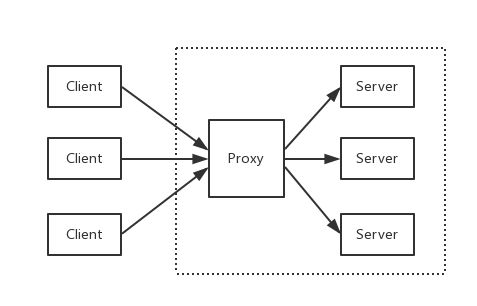

# Nginx基础知识

## 什么是nginx  
nginx是一款轻量级的Web服务器/反向代理服务器及电子邮件(IMAP/POP3)代理服务器，并在一个BSD-like协议下发行。  
nginx特点是占有内存少、并发强  
  


## nginx反向代理  
多个客户端给服务器发送的请求，Nginx服务器接收到之后，按照一定的规则分发给了后端的业务处理服务器进行处理。请求的来源也就是客户端是明确的，但是请求具体由哪台服务器处理的并不明确了，Nginx扮演的就是一个反向代理的角色。  
客户端是无感知代理的存在的，反向代理对外都是透明的，访问者并不知道自己访问的是一个代理。因为客户端不需要任何配置就可以访问。  
反向代理，“它代理的是服务端”，主要用于服务器集群分布式部署的情况下，反向代理隐藏了服务器的信息。  
### 什么是反向代理，什么是正向代理  
**正向代理**  
  
因为存在防火墙，我们并不能直接访问谷歌，那么我们可以借助VPN来实现，这就是一个简单的正向代理的例子。正向代理，“代理”的是客户端，而且客户端是知道目标的，而目标是不知道客户端是通过VPN访问的  
一般的访问流程是客户端直接向目标服务器发送请求并获取内容，使用正向代理后，客户端改为向代理服务器发送请求，并指定目标服务器（原始服务器），然后由代理服务器和原始服务器通信，转交请求并获得的内容，再返回给客户端。正向代理隐藏了真实的客户端，为客户端收发请求，使真实客户端对服务器不可见；
<br>

**反向代理**  
  
而当我们在外网访问百度时，其实会进行一个转发，代理到内网去，这就是所谓的反向代理，即反向代理“代理”的是服务端，而且这一个过程对于客户端而言是透明的。  
与一般访问流程相比，使用反向代理后，直接收到请求的服务器是代理服务器，然后将请求转发给内部网络上真正进行处理的服务器，得到的结果返回给客户端。反向代理隐藏了真实的服务器，为服务器收发请求，使真实服务器对客户端不可见。一般在处理跨域请求的时候比较常用。现在基本上所有的大型网站都设置了反向代理。

<br>

Nginx是一款面向性能设计的HTTP服务器，相较于Apache、Lighttpd具有占有内存少、稳定性高等优势。  
Nginx是一个Web Server，用于反向代理、负载均衡、邮件代理、TCP/UDP、HTTP服务器等等，它拥有很多吸引人的特性。  

+ 以较低的内存占用率处理10000多个并发连接(每10k非活动HTTP保持活动连接约2.5MB)  
+ 静态服务器(处理静态文件)  
+ 正向、反向代理  
+ 负载均衡  
+ Nginx + Lua
+ 通过 OpenSSL 对 TLS / SSL 与 SNI 和 OCSP 支持
+ FastCGI、SCGI、uWSGI 的支持
+ WebSockets、HTTP/1.1 的支持


## 常见命令  
+ nginx : 启动Nginx
+ nginx -s stop: 立刻停止Nginx服务  
+ nginx -s reload: 重新加载配置文件  
+ nginx -s quit: 平滑停止Nginx服务  
+ nginx -t: 测试配置文件是否正确  
+ nginx -v: 显示Nginx版本信息
+ nginx -V: 显示Nginx版本信息、编译器和配置参数的信息


## 配置信息  
1. proxy_pass:配置反向代理的路径。如果proxy_pass的url最后为/,则表示绝对路径。 ```个人理解的destination``` 
2. upstream:配置负载均衡。upstream默认是以轮询方式进行负载均衡，还支持以下4中模式:  
   (1) weight: 权重，指定轮询的概率,weight与访问概率成正比  
   (2) ip_hash: 按照访问IP的hash结果值分配  
   (3) fair: 按后端服务器的响应时间进行分配，响应时间越短优先级别越高  
   (4) url_hash: 按照访问的URL的hash结果值分配  


## 部署  
对nginx.conf进行配置，如果不知道对应的配置文件是哪个  
执行nginx -t看一下

```shell
$ nginx -t
nginx: the configuration file /usr/local/etc/nginx/nginx.conf syntax is ok
nginx: configuration file /usr/local/etc/nginx/nginx.conf test is successful
```
  

## 反向代理  
反向代理是指以代理服务器来接受网络上的连接请求，然后将请求转发给内部网络上的服务器，并将从服务器上得到的结果返回给请求连接的客户端，此时代理服务器对外就表现为一个反向代理服务器。
(个人企业级理解，隐藏真实服务端地址)  

  


## 配置hosts  
需要用本机作为演示，因此先把映射配上去
打开hosts配置映射  

```json
127.0.0.1       api.blog.com
```

配置nginx.conf  
打开文件增加server片段内容，设置server_name为api.blog.com并且监听8081端口，将所有路径转发到  
```http
http://127.0.0.1:8000/下
```

```conf
worker_processes  1;

events {
    worker_connections  1024;
}


http {
    include       mime.types;
    default_type  application/octet-stream;

    sendfile        on;
    keepalive_timeout  65;

    server {
        listen       8081;
        server_name  api.blog.com;

        location / {
            proxy_pass http://127.0.0.1:8000/;
        }
    }
}
```


## 负载均衡  
配置nginx.conf的老地方，增加负载均衡所需要的配置。新增upstream节点，设置其对应的2个后端服务  
```conf
worker_processes  1;

events {
    worker_connections  1024;
}


http {
    include       mime.types;
    default_type  application/octet-stream;

    sendfile        on;
    keepalive_timeout  65;

    upstream api.blog.com {
        server 127.0.0.1:8001;
        server 127.0.0.1:8002;
    }

    server {
        listen       8081;
        server_name  api.blog.com;

        location / {
            proxy_pass http://api.blog.com/;
        }
    }
}
```

