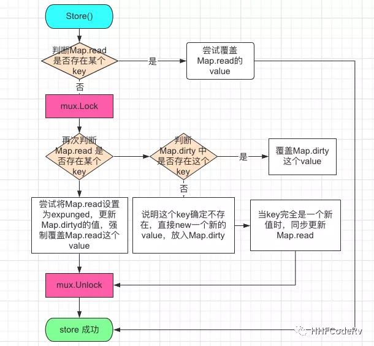

参考链接： 

1. https://colobu.com/2017/07/11/dive-into-sync-Map/    
2. https://eddycjy.com/posts/go/map/2019-03-05-map-access/  
3. https://mp.weixin.qq.com/s/kblDTqKlUaTITIppigq9yA


Golang中的map不支持并发读写，Golang团队为了解决这个问题实现了sync.Map  

## 在此前的解决方案  

使用嵌入struct的方式增加一个读写锁  

例如：  

```go
var counter = struct {
    sync.RWMutex
    m map[string]int
}{m: make(map[string]int)}
```

读取时:  

```go
counter.RLock()
n := counter.m["some_key"]
counter.RUnlock()
```

写入时：  
```go
counter.Lock()
counter.m["some_key"]++
counter.Unlock()
```

可以说，上面的解决方案已经是懂哥的解决思路，相当简洁漂亮美观  

## 为什么大家宁愿使用Mutex + Map, 也不愿使用sync.Map:  

1. sync.Map本身就很难用，使用起来根本就不像一个Map那样简单。失去了map应有的特权语法。  
2. sync.Map方法较多。让一个简单的Map使用起来有了较高的学习成本。  

用法demo

```go
package main

import (
	"fmt"
	"sync"
)

func main() {
	var syncMap sync.Map
	syncMap.Store("11", 11)
	syncMap.Store("22", 22)

	fmt.Println(syncMap.Load("11")) // 11
	fmt.Println(syncMap.Load("33")) // 空

	fmt.Println(syncMap.LoadOrStore("33", 33)) // 33
	fmt.Println(syncMap.Load("33"))            // 33

	syncMap.Delete("33")            // 33
	fmt.Println(syncMap.Load("33")) // 空

	syncMap.Range(func(key, value interface{}) bool {
		fmt.Printf("key:%v value:%v\n", key, value)
		return true
	})
	// key:22 value:22
	// key:11 value:11
}
```

其实 sync.Map 并不复杂，只是将普通 map 的相关操作转成对应函数而已。   

<br>


||普通map|sync.Map|
|:--:|:--:|:--:|
|map获取某个元素|map[1]|sync.Load(1)|
|map添加元素|map[1] = 10|sync.Store(1,10)|
|map删除一个key|delete(map, 1)|sync.Delete(1)|
|遍历map|for...range|sync.Range()|  

sync.Map 两个特有的函数，不过从字面就能理解是什么意思了。LoadOrStore：sync.Map 存在就返回，不存在就插入 LoadAndDelete：sync.Map 获取某个 key，如果存在的话，同时删除这个 key  

## 源码
```go
type Map struct {
    mu Mutex
    read atomic.Value // readOnly read map
    dirty map[interface{}]*entry
    misses int
}
```

  


    

   


### read map的值是什么时间更新的？  
1. Load/LoadOrStore/LoadAndDelete时，misses数量大于等于dirty map元素个数时，会整体复制dirty map到read map
2. Store/LoadOrStore时，当read map中存在这个key，则更新  
3. Delete/LoadAndDelete时，如果read map中存在这个key，则设置这个值为nil  

### dirty map的值是什么时间更新的？   
1. 完全是一个新key，第一次插入sync.Map，必先插入dirty map  
2. Store/LoadOrStore时，当read map中不存在这个key，在dirty map存在这个key，则更新  
3. Delete/LoadAndDelete时，如果read map中不存在这个key，在dirty map存在这个key，则从dirty map中删除这个key  
4. 当misses数量大于等于dirty map的元素个数时，会整体复制dirty map到read map，同时设置dirty map为nil  

疑问：当 dirty map 复制到 read map 后，将 dirty map 设置为 nil，也就是 dirty map 中就不存在这个 key 了。如果又新插入某个 key，多次访问后达到了 dirty map 往 read map 复制的条件，如果直接用 read map 覆盖 dirty map，那岂不是就丢了之前在 read map 但不在 dirty map 的 key ?  


答：其实并不会。当 dirty map 向 read map 复制后，readOnly.amended 等于了 false。当新插入了一个值时，会将 read map 中的值，重新给 dirty map 赋值一遍，也就是 read map 也会向 dirty map 中复制  

```go
func (m *Map) dirtyLocked() {
    if m.dirty != nil {
        return 
    }
    read, _ := m.read.Load().(readOnly)
    m.dirty = make(map[interface{}]*entry, len(read.m))
    for k, e := range read.m {
        if !e.tryExpungeLocked() {
            m.dirty[k] = e
        }
    }
}
```


