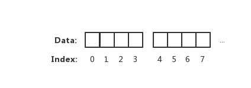
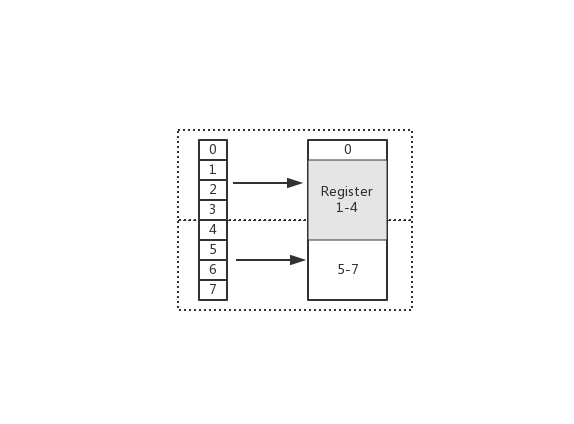

摘抄整理 原文链接：  
https://eddycjy.com/posts/go/talk/2018-12-26-go-memory-align/

# 字节对齐  
很喜欢知乎的一位懂哥的回答，不愧是懂哥，感觉都给他懂完了。
**书上写着: 不作死就不会死**  

小明：请问这本书的第三个字是什么？
小红：是个「死」字
小明：请问这本书的第六笔是什么？
小红：...好吧，是「作」的第二笔：竖
小明：请问这本书的第三、四、五、六笔构成的是什么字？
小红：给爷爬

实际上CPU并不会以一个一个字节去读取和写入内存。相反CPU读取内存是一块一块读取，块的大小可以分为2、4、6、8、16字节等大小。块的大小的我们称为内存访问粒度。如下图：  
  

在样例中，假设访问粒度为 4。 CPU 是以每 4 个字节大小的访问粒度去读取和写入内存的。这才是正确的姿势

## 为什么要进行字节对齐  
+ 平台(移植性)原因: 不是所有的硬件平台都能够访问任意地址上的任意数据。例如：特定的硬件平台只允许在特定地址获取特定类型的数据，否则会导致异常情况  

+ 性能原因: 若访问未对齐的内存，将会导致CPU进行两次内存访问，并且要花费额外的时钟周期来处理对齐及运算。而本身就对齐的内存仅需要一次访问就可以完成读取动作  
  

在上图中，假设从Index1开始读取，将会出现很崩溃的问题。因为它的内存访问边界是不对齐的。因此CPU会做一些额外的处理。如下：  
1. CPU首次读取未对齐地址的第一个内存快，读取0-3字节。并移除不需要的字节0  
2. CPU再次读取未对齐地址的第二个内存块，读取4-7字节。并移除不需要的字节5、6、7字节。
3. 合并1-4字节的数据
4. 合并后放入寄存器  

从上述流程我们知道，不做“内存对齐”，会增加许多耗费时间的动作

而假设做了内存对齐，从 Index 0 开始读取 4 个字节，只需要读取一次，也不需要额外的运算。这显然高效很多，是标准的空间换时间做法  

先来看看代码：  

```go
package main

import (
	"fmt"
	"unsafe"
)

type Part1 struct {
	a bool
	b int32
	c int8
	d int64
	e byte
}

func main() {
	fmt.Printf("bool size: %d\n", unsafe.Sizeof(bool(true)))
	fmt.Printf("int32 size: %d\n", unsafe.Sizeof(int32(0)))
	fmt.Printf("int8 size: %d\n", unsafe.Sizeof(int8(0)))
	fmt.Printf("int64 size: %d\n", unsafe.Sizeof(int64(0)))
	fmt.Printf("byte size: %d\n", unsafe.Sizeof(byte(0)))
	fmt.Printf("string size: %d\n", unsafe.Sizeof("fenghaojiang"))
}
```

以上代码的输出：
```go
bool size: 1
int32 size: 4
int8 size: 1
int64 size: 8
byte size: 1
string size: 16
```

众所周知，1(bool)+4(int32)+1(int8)+8(int64)+1(byte) = 15个字节

在上面代码加上下面这两行：
```go
part1 := Part1{}
fmt.Printf("part1 size: %d, align: %d\n", unsafe.Sizeof(part1), unsafe.Alignof(part1))
```

```go
part1 size: 32, align: 8
```
最后竟是32个字节，充分说明之前的是龙鸣计算方式。  

32个字节是怎么回事呢？字节相信大家都很熟悉，1个字节存储8位无符号数据0-255，但是32个字节是怎么回事呢，下面就让小编带大家一起了解吧。  

32个字节，大家可能会很惊讶怎么会是32个字节呢？但事实就是这样，小编也感到非常惊讶。  

这就是关于32个字节的事情了，大家有什么想法呢，欢迎在评论区告诉小编一起讨论哦！  

<br>


## 默认系数  
在不同平台上的编译器都有自己默认的 “对齐系数”，可通过预编译命令 #pragma pack(n) 进行变更，n 就是代指 “对齐系数”。一般来讲，我们常用的平台的系数如下：  
+ 32位：4
+ 64位：8

另外要注意，不同硬件平台占用的大小和对齐值都可能不一样。因此本文的值不是唯一的，调试的时候需要按本机的实际情况考虑  
执行以下代码：  
```go
func main() {
	fmt.Printf("bool align: %d\n", unsafe.Alignof(bool(true)))
	fmt.Printf("int32 align: %d\n", unsafe.Alignof(int32(0)))
	fmt.Printf("int8 align: %d\n", unsafe.Alignof(int8(0)))
	fmt.Printf("int64 align: %d\n", unsafe.Alignof(int64(0)))
	fmt.Printf("byte align: %d\n", unsafe.Alignof(byte(0)))
	fmt.Printf("string align: %d\n", unsafe.Alignof("EDDYCJY"))
	fmt.Printf("map align: %d\n", unsafe.Alignof(map[string]string{}))
}
```
输出结果：  
```go
bool align: 1
int32 align: 4
int8 align: 1
int64 align: 8
byte align: 1
string align: 8
map align: 8
```


在 Go 中可以调用 unsafe.Alignof 来返回相应类型的对齐系数。通过观察输出结果，可得知基本都是 2^n，最大也不会超过 8。这是因为我电脑（64 位）编译器默认对齐系数是 8，因此最大值不会超过这个数

## 整体对齐  
在上小节中，提到了结构体中的成员变量要做字节对齐。那么作为最终结果的结构体也是需要做字节对齐的  


## 对齐规则  
+ 结构体的成员变量，第一个成员变量的偏移量为 0。往后的每个成员变量的对齐值必须为编译器默认对齐长度（#pragma pack(n)）或当前成员变量类型的长度（unsafe.Sizeof），取最小值作为当前类型的对齐值。其偏移量必须为对齐值的整数倍
+ 结构体本身，对齐值必须为编译器默认对齐长度（#pragma pack(n)）或结构体的所有成员变量类型中的最大长度，取最大数的最小整数倍作为对齐值
+ 结合以上两点，可得知若编译器默认对齐长度（#pragma pack(n)）超过结构体内成员变量的类型最大长度时，默认对齐长度是没有任何意义的

(煎鱼写的这段绕半天，不好)  
我总结一下：  

+ 对于成员变量，第一个偏移量为0，每个成员变量对齐值为默认长度与变量类型长度的较小值
+ 对于结构体，对齐值是默认长度与所有成员变量之中长度的最大值。取最大值的最小整数倍作为对齐值  

|成员变量|类型|偏移量|自身占用|
|:---:|:---:|:---:|:---:|
|a|bool|0|1|
|b|int32|4|4|
|c|int8|8|1|
|d|int64|16|8|
|e|byte|24|1|
|总占用大小|-|-|32|


## 成员对齐
* 第一个成员 a
  * 类型为 bool
  * 大小/对齐值为 1 字节
  * 初始地址，偏移量为 0。占用了第 1 位
* 第二个成员 b
  * 类型为 int32
  * 大小/对齐值为 4 字节
  * 根据规则 1，其偏移量必须为 4 的整数倍。确定偏移量为 4，因此 2-4 位为 Padding。而当前数值从第 5 位开始填充，到第 8 位。如下：axxx|bbbb
* 第三个成员 c
  * 类型为 int8
  * 大小/对齐值为 1 字节
  * 根据规则 1，其偏移量必须为 1 的整数倍。当前偏移量为 8。不需要额外对齐，填充 1 个字节到第 9 位。如下：axxx|bbbb|c…
* 第四个成员 d
  * 类型为 int64
  * 大小/对齐值为 8 字节
  * 根据规则 1，其偏移量必须为 8 的整数倍。确定偏移量为 16，因此 9-16 位为 Padding。而当前数值从第 17 位开始写入，到第 24 位。如下：axxx|bbbb|cxxx|xxxx|dddd|dddd
* 第五个成员 e
  * 类型为 byte
  * 大小/对齐值为 1 字节
  * 根据规则 1，其偏移量必须为 1 的整数倍。当前偏移量为 24。不需要额外对齐，填充 1 个字节到第 25 位。如下：axxx|bbbb|cxxx|xxxx|dddd|dddd|e…

<br>

## 整体对齐
在每个成员变量进行对齐后，根据规则 2，整个结构体本身也要进行字节对齐，因为可发现它可能并不是 2^n，不是偶数倍。显然不符合对齐的规则

根据规则 2，可得出对齐值为 8。现在的偏移量为 25，不是 8 的整倍数。因此确定偏移量为 32。对结构体进行对齐

## 结果
Part1 内存布局：axxx|bbbb|cxxx|xxxx|dddd|dddd|exxx|xxxx


## 结论
通过本节的分析，可得知先前的 “推算” 为什么错误？

是因为实际内存管理并非 “一个萝卜一个坑” 的思想。而是一块一块。通过空间换时间（效率）的思想来完成这块读取、写入。另外也需要兼顾不同平台的内存操作情况


## 巧妙调整结构体顺序  

执行以下代码：  

```go
type Part1 struct {
	a bool
	b int32
	c int8
	d int64
	e byte
}

type Part2 struct {
	e byte
	c int8
	a bool
	b int32
	d int64
}

func main() {
	part1 := Part1{}
	part2 := Part2{}

	fmt.Printf("part1 size: %d, align: %d\n", unsafe.Sizeof(part1), unsafe.Alignof(part1))
	fmt.Printf("part2 size: %d, align: %d\n", unsafe.Sizeof(part2), unsafe.Alignof(part2))
}
```

执行结果：  
```go
part1 size: 32, align: 8
part2 size: 16, align: 8
```
来演示一遍part2怎么做到的

|成员变量|类型|偏移量|自身占用|
|:---:|:---:|:---:|:---:|
|e|byte|0|1|
|c|int8|1|1|
|a|bool|2|1|
|b|int32|4|4|
|d|int64|8|8|
|总占用大小|-|-|16|

## 成员对齐
+ 第一个成员 e
  + 类型为 byte
  + 大小/对齐值为 1 字节
  + 初始地址，偏移量为 0。占用了第 1 位
+ 第二个成员 c
  + 类型为 int8
  + 大小/对齐值为 1 字节
  + 根据规则 1，其偏移量必须为 1 的整数倍。当前偏移量为 2。不需要额外对齐
+ 第三个成员 a
  + 类型为 bool
  + 大小/对齐值为 1 字节
  + 根据规则 1，其偏移量必须为 1 的整数倍。当前偏移量为 3。不需要额外对齐
+ 第四个成员 b
  + 类型为 int32
  + 大小/对齐值为 4 字节
  + 根据规则 1，其偏移量必须为 4 的整数倍。确定偏移量为 4，因此第 3 位为 Padding。而当前数值从第 4 位开始填充，到第 8 位。如下：ecax|bbbb
+ 第五个成员 d
  + 类型为 int64
  + 大小/对齐值为 8 字节
根据规则 1，其偏移量必须为 8 的整数倍。当前偏移量为 8。不需要额外对齐，从 9-16 位填充 8 个字节。如下：ecax|bbbb|dddd|dddd


## 整体对齐  
通过对比Part1和Part2的内存布局，你会发现两者有很大的不同。
+ Part1: axxx|bbbb|cxxx|xxxx|dddd|dddd|exxx|xxxx
+ Part2: ecax|bbbb|dddd|dddd


是不是都给我懂完了?

